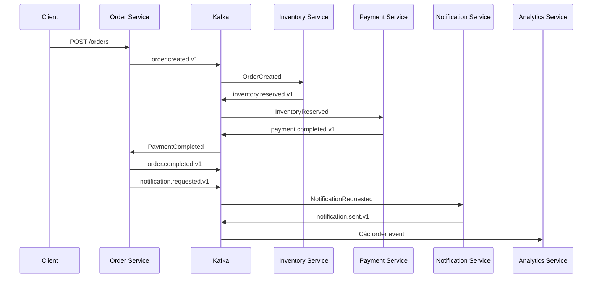
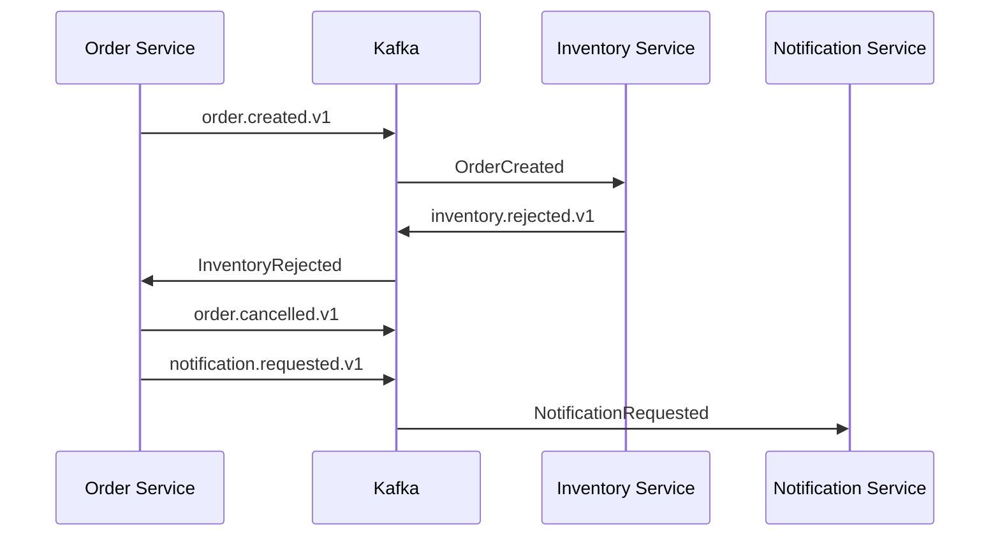
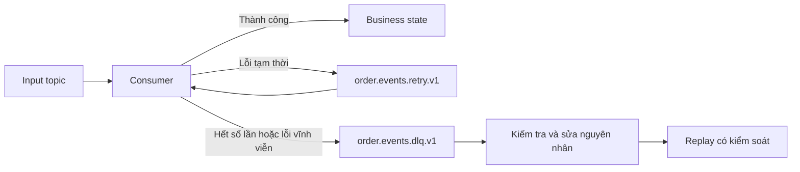
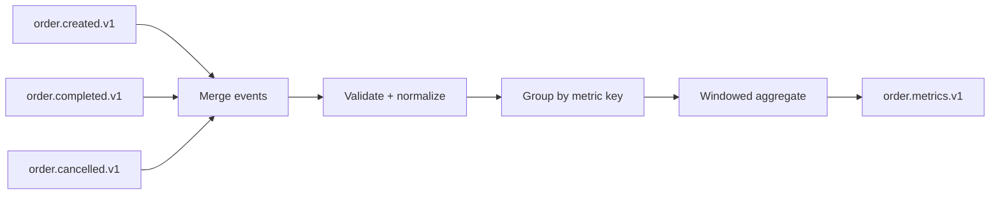

# Lộ trình học Apache Kafka từ số 0 qua Kafka Order Platform

Tài liệu này là bản hướng dẫn học và thực hành cho toàn bộ project. Mục tiêu
không phải là hoàn thành thật nhanh một hệ thống microservice, mà là dùng từng
phần của hệ thống đặt hàng để quan sát và hiểu cách Kafka hoạt động.

Sau khi hoàn thành lộ trình, bạn cần có khả năng tự giải thích:

- Vì sao dùng Kafka thay vì gọi HTTP trực tiếp trong một số luồng.
- Một record đi từ producer tới broker, partition và consumer như thế nào.
- Message key ảnh hưởng đến partition và thứ tự ra sao.
- Consumer group phân chia công việc như thế nào.
- Offset là gì, khi nào commit offset và vì sao có thể mất hoặc xử lý trùng dữ
  liệu.
- Kafka đảm bảo điều gì và ứng dụng vẫn phải tự đảm bảo điều gì.
- Cách xử lý retry, Dead Letter Queue, poison message và idempotency.
- Sự khác nhau giữa retention và log compaction.
- Phạm vi thực sự của at-most-once, at-least-once và exactly-once.
- Vì sao cần Transactional Outbox khi vừa ghi database vừa publish event.
- Kafka Streams xử lý, tổng hợp và lưu state như thế nào.
- Cách quan sát consumer lag, rebalance, throughput và các lỗi quan trọng.
- Những thay đổi cần có trước khi một cấu hình local có thể tiến gần production.

> Không dùng tài liệu này như một danh sách để copy code. Với mỗi giai đoạn, hãy
> dự đoán kết quả trước, tự cài đặt, quan sát Kafka UI hoặc CLI, cố tình gây lỗi,
> rồi mới đối chiếu với phần giải thích.

---

## 1. Tài liệu tham khảo và lưu ý về phiên bản

Tài liệu sách chính:

**Kafka: The Definitive Guide - Real-Time Data and Stream Processing at Scale,
Second Edition**, Gwen Shapira, Todd Palino, Rajini Sivaram và Krit Petty.

Các chương được sử dụng nhiều nhất:

| Nội dung | Chương sách | Trang bắt đầu trong file PDF |
|---|---:|---:|
| Tổng quan Kafka | Chapter 1 - Meet Kafka | 22 |
| Cài đặt và broker | Chapter 2 - Installing Kafka | 48 |
| Producer | Chapter 3 - Kafka Producers | 91 |
| Consumer và consumer group | Chapter 4 - Kafka Consumers | 135 |
| Admin API và topic | Chapter 5 - Managing Kafka Programmatically | 189 |
| Cơ chế nội bộ, replication, storage, compaction | Chapter 6 - Kafka Internals | 221 |
| Reliable delivery | Chapter 7 - Reliable Data Delivery | 263 |
| Exactly-once và transaction | Chapter 8 - Exactly-Once Semantics | 295 |
| Data pipeline và Kafka Connect | Chapter 9 - Building Data Pipelines | 327 |
| Bảo mật | Chapter 11 - Securing Kafka | 420 |
| Công cụ quản trị | Chapter 12 - Administering Kafka | 482 |
| Monitoring | Chapter 13 - Monitoring Kafka | 533 |
| Stream processing | Chapter 14 - Stream Processing | 596 |

### Khác biệt quan trọng giữa sách và project

Second Edition được xuất bản trước Kafka 4.x. Sách vẫn rất tốt cho producer,
consumer, partition, offset, reliability, transactions, Connect, monitoring và
Streams. Tuy nhiên, phần cài đặt có nhiều nội dung về ZooKeeper.

Project này dùng:

- Apache Kafka 4.3.1.
- KRaft để quản lý metadata cluster.
- Một process local đóng cả vai trò broker và controller.
- Không dùng ZooKeeper.

Kafka 4.0 là dòng đầu tiên vận hành hoàn toàn không cần ZooKeeper. Vì vậy:

- Đọc phần ZooKeeper để hiểu lịch sử, không làm theo hướng dẫn cài ZooKeeper.
- Học khái niệm controller trong sách, sau đó đối chiếu với KRaft hiện tại.
- Dùng `compose.yaml` của project làm nguồn cấu hình chạy local.
- Khi một tên cấu hình trong sách khác tài liệu hiện hành, ưu tiên tài liệu
  chính thức của phiên bản đang chạy.

### Nguồn hiện hành nên đối chiếu

- [Apache Kafka 4.3 documentation](https://kafka.apache.org/43/documentation/)
- [Kafka design](https://kafka.apache.org/43/design/design/)
- [Kafka APIs](https://kafka.apache.org/43/apis/)
- [KRaft operations](https://kafka.apache.org/43/operations/kraft/)
- [Kafka Streams](https://kafka.apache.org/43/streams/)
- [Spring Boot Kafka reference](https://docs.spring.io/spring-boot/4.1/reference/messaging/kafka.html)
- [Spring for Apache Kafka reference](https://docs.spring.io/spring-kafka/reference/)

---

## 2. Cách học với project này

Mỗi bài thực hành nên đi theo vòng lặp:

1. **Đọc:** chỉ đọc phần lý thuyết cần cho bài hiện tại.
2. **Dự đoán:** ghi lại record sẽ vào topic nào, partition nào và consumer nào.
3. **Làm:** tự viết phần code nhỏ nhất để kiểm chứng.
4. **Quan sát:** dùng Kafka UI, log có cấu trúc và Kafka CLI.
5. **Phá:** dừng service, gửi trùng event, đổi key hoặc làm database lỗi.
6. **Giải thích:** viết lại bằng lời của bạn điều vừa xảy ra.
7. **Sửa:** bổ sung cơ chế reliability phù hợp.
8. **Kiểm chứng lại:** chạy cùng kịch bản lỗi và so sánh kết quả.

Không nên viết cả năm service rồi mới chạy lần đầu. Nếu làm như vậy, khi lỗi xảy
ra bạn sẽ không biết vấn đề nằm ở HTTP, database, serialization, Kafka, offset
hay logic nghiệp vụ.

### Mẫu ghi chép cho mỗi buổi

```text
Ngày:
Giai đoạn:
Khái niệm hôm nay:

Tôi dự đoán:
- Topic:
- Message key:
- Partition:
- Consumer group:
- Offset trước và sau:
- Điều xảy ra nếu service chết:

Tôi quan sát được:

Kết quả có khác dự đoán không:

Một điều tôi có thể tự giải thích:

Một câu hỏi còn lại:
```

### Nguyên tắc tiến độ

- Không chuyển giai đoạn nếu chưa đạt phần "Hoàn thành khi".
- Mỗi lần chỉ thêm một khái niệm mới.
- Giữ event và nghiệp vụ đơn giản; độ khó phải đến từ Kafka.
- Luôn có `eventId`, `orderId` và log correlation để truy vết.
- Trước mỗi thí nghiệm lỗi, ghi rõ bạn dự đoán mất event hay trùng event.

---

## 3. Bài toán của project

Người dùng gửi yêu cầu tạo đơn. Hệ thống cần:

1. Lưu đơn hàng.
2. Kiểm tra và giữ tồn kho.
3. Thanh toán giả lập.
4. Hoàn thành hoặc hủy đơn.
5. Gửi thông báo.
6. Tổng hợp số đơn và doanh thu.

Luồng thành công:



Luồng thất bại do hết hàng:



### Trách nhiệm dự kiến của từng module

| Module | Ghi database | Produce | Consume |
|---|---|---|---|
| order-service | Order, order history, outbox | OrderCreated, OrderCompleted, OrderCancelled, NotificationRequested, OrderState | InventoryReserved, InventoryRejected, PaymentCompleted, PaymentFailed |
| inventory-service | Product stock, reservation, processed event | InventoryReserved, InventoryRejected | OrderCreated |
| payment-service | Payment, processed event | PaymentCompleted, PaymentFailed | InventoryReserved |
| notification-service | Notification, processed event | NotificationSent | NotificationRequested |
| analytics-service | Projection tùy chọn | OrderMetrics | OrderCreated, OrderCompleted, OrderCancelled |
| shared-events | Không | Không | Không |

`shared-events` chỉ chứa event contract. Không đặt business service, repository
hoặc Kafka listener vào module này.

---

## 4. Kiến thức nền tối thiểu

Bạn không cần biết microservice trước khi bắt đầu, nhưng nên nắm mức cơ bản:

### Java

- Class, record, interface và enum.
- Exception.
- Collection.
- Generic.
- `CompletableFuture` ở mức hiểu callback thành công/thất bại.
- Unit test cơ bản.

### Spring Boot

- Dependency injection.
- `@RestController`, service và repository.
- Configuration trong `application.yml`.
- Profile và environment variable.
- Cách ứng dụng khởi động và cách đọc log.

### Database

- Table, primary key, unique constraint và index.
- Transaction: commit và rollback.
- Isolation ở mức khái niệm.
- Vì sao hai database transaction riêng biệt không tự động atomic.

### Hạ tầng

- Container, image, volume và port.
- JSON.
- HTTP request/response.
- Chạy lệnh trong terminal.

Nếu một phần chưa biết, chỉ học đủ để tiếp tục bài Kafka. Không biến project
thành khóa học sâu về Spring hoặc PostgreSQL.

---

## 5. Mô hình tư duy cốt lõi

### 5.1 Kafka là gì?

Kafka là một distributed event streaming platform. Trong project này, hãy hình
dung Kafka là một commit log phân tán:

- Producer append record vào cuối log.
- Record thuộc một topic và chính xác một partition.
- Broker lưu record theo retention policy.
- Consumer tự giữ vị trí đã đọc bằng offset.
- Nhiều consumer group có thể đọc cùng record độc lập.
- Việc một consumer đã đọc không làm record biến mất khỏi topic.

Kafka không chỉ là "hàng đợi nhanh". Điểm khác biệt quan trọng là dữ liệu được
giữ lại và có thể đọc lại.

### 5.2 Record

Một Kafka record thường có:

| Thành phần | Ý nghĩa |
|---|---|
| Topic | Luồng logic chứa record |
| Partition | Log vật lý mà record được append |
| Offset | Vị trí tăng dần trong partition |
| Key | Dùng để chọn partition và thể hiện identity |
| Value | Payload |
| Timestamp | Thời điểm record được tạo hoặc ghi |
| Headers | Metadata bổ sung |

Trong project:

```text
topic     = order.created.v1
key       = ORD-10001
value     = JSON của OrderCreated
partition = kết quả partitioner chọn từ key
offset    = vị trí do broker cấp
```

### 5.3 Topic

Topic là tên logic của một stream. Topic không phải một file đơn và cũng không
phải consumer queue riêng cho từng service.

Ví dụ:

- `order.created.v1`: sự kiện đơn đã được tạo.
- `payment.failed.v1`: sự kiện thanh toán đã thất bại.
- `order.state.v1`: trạng thái mới nhất của đơn, dùng compaction.

Quy tắc đặt tên trong project:

- Sự kiện dùng động từ quá khứ: `created`, `completed`, `failed`.
- Version nằm trong tên topic ở giai đoạn đầu: `.v1`.
- Không dùng một topic chung tên `events` cho mọi loại dữ liệu khi mới học.

### 5.4 Partition

Mỗi partition là một ordered append-only log. Kafka chỉ đảm bảo thứ tự bên
trong một partition.

```text
order.created.v1
├── partition 0: offset 0, 1, 2, ...
├── partition 1: offset 0, 1, 2, ...
└── partition 2: offset 0, 1, 2, ...
```

Offset `10` ở partition `0` và offset `10` ở partition `1` là hai vị trí hoàn
toàn khác nhau.

Partition quyết định:

- Mức song song tối đa của một consumer group.
- Phạm vi đảm bảo thứ tự.
- Cách dữ liệu được phân bố trên broker.
- Đơn vị replication.

### 5.5 Message key

Khi có key, producer thường hash key để chọn partition. Cùng một key sẽ được đưa
vào cùng partition, miễn số partition và partitioner không thay đổi.

Project dùng:

```text
key = orderId
```

Trong **cùng một topic**, các record của `ORD-10001` sẽ đi vào cùng partition và
Kafka giữ thứ tự của chúng trong partition đó.

```text
OrderCreated revision 1 -> OrderCreated revision 2 -> OrderCreated revision 3
```

Project dùng nhiều topic khác nhau cho Inventory, Payment và Order. Kafka không
đảm bảo một thứ tự toàn cục giữa `order.created.v1`,
`inventory.reserved.v1` và `payment.completed.v1`, dù tất cả dùng cùng
`orderId`. Vì vậy Order Service vẫn cần state machine, version hoặc invariant để
xử lý event lặp, đến muộn và sai thứ tự.

Lỗi phổ biến:

- Không truyền key nên record phân bố không phù hợp với yêu cầu ordering.
- Dùng `eventId` làm key, khiến mỗi event của cùng một order có thể vào partition
  khác nhau.
- Cho rằng Kafka giữ thứ tự trên toàn topic.
- Cho rằng cùng key tạo ordering xuyên qua nhiều topic.
- Tăng số partition mà không đánh giá việc mapping key có thể thay đổi.

### 5.6 Broker, cluster và controller

- **Broker:** server nhận, lưu và phục vụ record.
- **Cluster:** một hoặc nhiều broker.
- **Controller:** quản lý metadata và điều phối các thay đổi của cluster.
- **KRaft:** cơ chế consensus hiện hành dùng quorum controller để quản lý
  metadata, thay cho ZooKeeper.

Local project chỉ có một process giữ cả vai trò broker và controller. Cấu hình
này dễ học nhưng không thể chứng minh high availability.

### 5.7 Producer

Producer tạo record và gửi đến Kafka. Producer chịu trách nhiệm:

- Chọn topic.
- Chọn key.
- Serialize key và value thành bytes.
- Chọn partition.
- Batch và gửi request.
- Nhận acknowledgment hoặc lỗi.
- Retry các lỗi phù hợp.

Producer không biết business event đã được consumer xử lý thành công hay chưa.
Kafka acknowledgment chỉ xác nhận việc ghi record theo cấu hình `acks`.

### 5.8 Consumer

Consumer pull record từ broker. Consumer chịu trách nhiệm:

- Subscribe topic.
- Poll record.
- Deserialize.
- Chạy business logic.
- Quản lý lỗi.
- Commit offset vào thời điểm phù hợp.

Không nên giữ poll loop bận quá lâu. Nếu xử lý vượt `max.poll.interval.ms`,
consumer có thể bị coi là không còn hoạt động và group sẽ rebalance.

### 5.9 Consumer group

Các consumer cùng `group.id` phối hợp để chia partition.

Nếu topic có 3 partition:

| Số consumer trong cùng group | Kết quả |
|---:|---|
| 1 | Consumer giữ cả 3 partition |
| 2 | Một consumer giữ 2, consumer còn lại giữ 1 |
| 3 | Mỗi consumer giữ 1 partition |
| 4 | Có 1 consumer không được gán partition |

Hai group khác nhau nhận dữ liệu độc lập. Ví dụ:

- `inventory-service` đọc `order.created.v1`.
- `analytics-service` cũng có thể đọc `order.created.v1`.

Một group đọc record không làm group kia mất record.

### 5.10 Rebalance

Rebalance là quá trình phân chia lại partition khi:

- Consumer tham gia hoặc rời group.
- Consumer bị timeout.
- Số partition thay đổi.
- Subscription thay đổi.

Trong thời gian rebalance, xử lý có thể tạm dừng. Rebalance cũng tạo ra các tình
huống khó về commit offset và record đang xử lý dở.

### 5.11 Offset

Offset là vị trí của record trong một partition. Consumer group lưu committed
offset để biết nơi tiếp tục sau khi khởi động lại.

Điểm rất dễ nhầm:

- Offset thuộc partition, không phải toàn topic.
- Current position và committed offset có thể khác nhau.
- Committed offset về mặt khái niệm là vị trí tiếp theo cần đọc.
- `auto.offset.reset=earliest` không có nghĩa consumer luôn đọc từ đầu. Nó chỉ
  có hiệu lực khi group chưa có offset hợp lệ.
- Commit offset không xóa record.

### 5.12 Consumer lag

Lag là khoảng cách giữa log end offset và committed/current position của
consumer group.

```text
log end offset = 1000
consumer offset = 920
lag = 80
```

Lag tăng liên tục có thể cho thấy:

- Consumer xử lý chậm.
- Consumer lỗi.
- Số partition hoặc consumer chưa đủ.
- Database downstream chậm.
- Có poison message gây retry lặp.

Lag bằng 0 không tự động chứng minh business data đúng.

### 5.13 Serialization và schema

Kafka lưu bytes, không hiểu JSON field nào là `orderId`. Serializer chuyển object
thành bytes; deserializer làm chiều ngược lại.

Giai đoạn đầu dùng JSON string để nhìn thấy dữ liệu rõ ràng. Giai đoạn sau mới
chuyển sang Avro hoặc Protobuf và Schema Registry.

Schema tốt cần:

- Có version.
- Field mới có default hợp lý hoặc optional.
- Không đổi ý nghĩa field cũ một cách âm thầm.
- Có compatibility rule.
- Consumer cũ và mới cùng tồn tại được trong thời gian rollout.

### 5.14 Retention

Retention quyết định Kafka giữ record bao lâu hoặc tới dung lượng nào. Consumer
đã đọc hay chưa không quyết định retention.

Event topic trong project giữ 7 ngày. DLQ giữ 30 ngày.

### 5.15 Log compaction

Compaction giữ ít nhất giá trị mới nhất cho mỗi key thay vì giữ mọi phiên bản
vĩnh viễn.

```text
ORD-1 -> CREATED
ORD-1 -> PAID
ORD-1 -> COMPLETED
```

Sau compaction, bản cũ có thể được dọn và bản `COMPLETED` được giữ. Compaction
chạy nền, không xảy ra ngay lập tức.

Record có key và value `null` được gọi là **tombstone**, dùng để biểu diễn xóa
key khỏi compacted topic sau thời gian giữ tombstone.

### 5.16 Replication

Mỗi partition có thể có nhiều replica:

- Leader phục vụ produce/fetch.
- Follower sao chép dữ liệu từ leader.
- ISR là tập replica đang theo kịp leader.

`replication.factor=1` trong project nghĩa là mất broker có thể làm mất khả năng
phục vụ và có rủi ro mất dữ liệu. Giai đoạn production lab mới đổi sang ba
broker.

### 5.17 Event, command và state

| Loại | Ý nghĩa | Ví dụ |
|---|---|---|
| Event | Sự thật đã xảy ra | `OrderCreated`, `PaymentFailed` |
| Command | Yêu cầu ai đó làm việc | `ReserveInventory`, `SendNotification` |
| State | Ảnh chụp trạng thái hiện tại | `OrderState=COMPLETED` |

Event không nên đặt tên mơ hồ như `ProcessOrder`. Một event đã publish không nên
được sửa lại; nếu sự thật thay đổi, publish event mới.

### 5.18 Idempotency

Một handler idempotent cho kết quả cuối giống nhau dù nhận cùng event nhiều lần.

Ví dụ không idempotent:

```text
Nhận lại InventoryReserved hai lần
-> trừ kho hai lần
```

Giải pháp cơ bản:

- Mỗi event có `eventId` duy nhất.
- Consumer có bảng `processed_events`.
- Trong cùng database transaction:
  - Kiểm tra hoặc insert `eventId`.
  - Thực hiện business update.
  - Commit.
- Unique constraint trên `event_id` là hàng rào cuối.

Idempotent producer và idempotent consumer là hai khái niệm khác nhau.

### 5.19 Retry và Dead Letter Queue

- **Retryable error:** lỗi tạm thời, ví dụ database timeout.
- **Non-retryable error:** payload sai schema hoặc vi phạm invariant.
- **Business rejection:** kết quả nghiệp vụ hợp lệ, ví dụ hết hàng; đây không
  phải lỗi kỹ thuật.
- **Poison message:** record luôn làm consumer thất bại.
- **DLQ/DLT:** topic giữ record không thể xử lý sau chính sách retry.

Không retry vô hạn trong poll thread. Retry phải có:

- Số lần tối đa.
- Backoff.
- Phân loại exception.
- Metadata về lỗi và lần thử.
- Cơ chế xem, sửa và replay DLQ.

### 5.20 Delivery semantics

| Semantics | Khả năng mất | Khả năng trùng | Cách hình thành điển hình |
|---|---|---|---|
| At-most-once | Có | Không | Commit trước khi xử lý |
| At-least-once | Không sau khi Kafka đã nhận bền vững | Có | Xử lý xong rồi commit |
| Exactly-once | Tùy phạm vi | Không trong phạm vi transaction | Kafka transaction hoặc Kafka Streams EOS |

Trong project, mặc định nên học **at-least-once + idempotent consumer** trước.

Exactly-once của Kafka không tự động khiến một email ngoài hệ thống chỉ được gửi
một lần, và cũng không tự động gộp Kafka transaction với PostgreSQL transaction.
Luôn hỏi: "Exactly once trong phạm vi nào?"

### 5.21 Transactional Outbox

Dual-write problem:

```text
1. Ghi order vào PostgreSQL thành công
2. Ứng dụng chết trước khi publish OrderCreated
3. Database có order nhưng Kafka không có event
```

Outbox giải quyết bằng cách ghi business row và outbox row trong cùng một
database transaction. Một publisher riêng đọc outbox và publish lên Kafka.
Publisher có thể gửi trùng, nên consumer vẫn cần idempotency.

### 5.22 Kafka Streams

Kafka Streams là thư viện chạy trong ứng dụng Java, không phải một cluster xử lý
riêng.

Khái niệm chính:

- **Topology:** đồ thị các bước xử lý.
- **KStream:** chuỗi event thay đổi theo thời gian.
- **KTable:** cách nhìn bảng, mỗi key có giá trị hiện tại.
- **State store:** state local phục vụ aggregation/join.
- **Changelog topic:** backup state store trong Kafka.
- **Window:** nhóm event theo khoảng thời gian.
- **Event time:** thời gian sự kiện thực sự xảy ra.
- **Grace period:** khoảng chờ event đến muộn.
- **Repartition topic:** topic nội bộ khi cần phân bố lại key.

---

## 6. Event contract dự kiến

Trong giai đoạn đầu, mọi event nên có envelope nhất quán:

```json
{
  "eventId": "c58d0ed9-6b51-4d43-8078-e63ae6335ac5",
  "eventType": "OrderCreated",
  "eventVersion": 1,
  "occurredAt": "2026-07-25T13:30:00Z",
  "correlationId": "ORD-10001",
  "causationId": null,
  "producer": "order-service",
  "orderId": "ORD-10001",
  "payload": {
    "customerId": "CUS-101",
    "totalAmount": 750000,
    "currency": "VND",
    "items": [
      {
        "productId": "P-01",
        "quantity": 2,
        "unitPrice": 375000
      }
    ]
  }
}
```

Ý nghĩa:

| Field | Mục đích |
|---|---|
| eventId | Nhận diện lần phát event và chống xử lý trùng |
| eventType | Phân biệt loại event |
| eventVersion | Hỗ trợ schema evolution |
| occurredAt | Event time |
| correlationId | Gom log của cùng một business flow |
| causationId | Event hoặc command trực tiếp gây ra event hiện tại |
| producer | Service phát event |
| orderId | Aggregate key và Kafka message key |
| payload | Dữ liệu riêng của event |

Không đưa vào event:

- Password hoặc secret.
- Thông tin thanh toán nhạy cảm.
- Object database nguyên khối.
- Field không consumer nào cần.
- Timestamp không có timezone.

---

## 7. Tổng quan các giai đoạn

| Giai đoạn | Trọng tâm | Kết quả hữu hình |
|---:|---|---|
| 0 | Hạ tầng và mô hình Kafka | Chạy broker, UI, PostgreSQL; mô tả được topic/partition/offset |
| 1 | Kafka CLI và log | Tự produce/consume record, quan sát key/partition/offset |
| 2 | Producer đầu tiên | Order Service publish `OrderCreated` |
| 3 | Consumer đầu tiên | Inventory Service consume và quản lý offset |
| 4 | Luồng nghiệp vụ hoàn chỉnh | Order đi qua Inventory, Payment, Notification |
| 5 | Ordering, scale và rebalance | Chạy nhiều consumer, chứng minh giới hạn theo partition |
| 6 | Reliability và idempotency | Chịu được duplicate và restart |
| 7 | Retry, DLQ và replay lỗi | Phân loại lỗi, retry hữu hạn, replay DLQ |
| 8 | Kafka transaction, Outbox và Connect | Phân biệt atomic Kafka-to-Kafka với DB-to-Kafka |
| 9 | Schema evolution | Consumer cũ/mới tương thích |
| 10 | Retention, compaction và replay | Rebuild state từ log, hiểu tombstone |
| 11 | Kafka Streams | Tạo realtime order metrics |
| 12 | Monitoring, security và production thinking | Theo dõi lag, failure drill, nêu khác biệt local/production |

---

## 8. Giai đoạn 0 - Khởi động hạ tầng và xây mental model

### Mục tiêu

- Chạy Kafka, Kafka UI và PostgreSQL.
- Biết vai trò từng container.
- Hiểu khác nhau giữa host port và container port.
- Nhìn thấy 13 topic đã được tạo.
- Chưa viết Java.

### Đọc trước

- Sách: Chapter 1.
- Sách: Chapter 2, chỉ phần broker/topic configuration.
- Không làm theo phần cài ZooKeeper.
- Tài liệu hiện hành: KRaft operations.

### Thực hành

1. Tạo `.env` từ `.env.example`.
2. Chạy `docker compose up -d`.
3. Xem trạng thái:

   ```bash
   docker compose ps
   ```

4. Mở Kafka UI tại `http://localhost:8088`.
5. Tìm các topic:

   ```bash
   docker compose exec kafka \
     /opt/kafka/bin/kafka-topics.sh \
     --bootstrap-server kafka:19092 \
     --list
   ```

6. Describe một topic:

   ```bash
   docker compose exec kafka \
     /opt/kafka/bin/kafka-topics.sh \
     --bootstrap-server kafka:19092 \
     --describe \
     --topic order.created.v1
   ```

7. Đối chiếu kết quả với `infrastructure/kafka/topics.md`.
8. Kiểm tra năm database bằng công cụ PostgreSQL bạn quen dùng.

### Câu hỏi phải tự trả lời

- Vì sao ứng dụng trên máy dùng `localhost:9093`, còn container dùng
  `kafka:19092`?
- Vì sao topic có ba partition nhưng replication factor chỉ là một?
- `kafka-init` chạy một lần để làm gì?
- Vì sao tắt auto topic creation?
- Dữ liệu còn hay mất khi `docker compose down`?
- Dữ liệu còn hay mất khi `docker compose down -v`?

### Thí nghiệm

- Dừng `kafka-ui`: broker có tiếp tục hoạt động không?
- Khởi động lại `kafka-ui`: dữ liệu có còn không?
- Dừng Kafka rồi mở UI: UI biểu hiện ra sao?
- Không xóa volume ở giai đoạn này.

### Hoàn thành khi

- Bạn vẽ được broker, controller, producer, consumer, topic và partition.
- Bạn mô tả được từng service trong Compose.
- Bạn tìm và describe được topic bằng cả UI và CLI.
- Bạn hiểu local cluster một broker không có high availability.

---

## 9. Giai đoạn 1 - Produce và consume bằng CLI

### Mục tiêu

Quan sát trực tiếp record trước khi Spring Boot che bớt chi tiết.

### Đọc trước

- Sách Chapter 1: Messages and Batches, Topics and Partitions, Producers and
  Consumers.
- Sách Chapter 12: Producing and Consuming.

### Thực hành

Mở console producer có key:

```bash
docker compose exec kafka \
  /opt/kafka/bin/kafka-console-producer.sh \
  --bootstrap-server kafka:19092 \
  --topic order.created.v1 \
  --property parse.key=true \
  --property key.separator=:
```

Nhập từng dòng:

```text
ORD-1:{"eventType":"OrderCreated","orderId":"ORD-1"}
ORD-2:{"eventType":"OrderCreated","orderId":"ORD-2"}
ORD-1:{"eventType":"OrderCreatedAgain","orderId":"ORD-1"}
```

Mở console consumer:

```bash
docker compose exec kafka \
  /opt/kafka/bin/kafka-console-consumer.sh \
  --bootstrap-server kafka:19092 \
  --topic order.created.v1 \
  --from-beginning \
  --property print.key=true \
  --property print.partition=true \
  --property print.offset=true \
  --property print.timestamp=true
```

### Điều cần quan sát

- Hai record có key `ORD-1` nằm ở đâu?
- Offset tăng như thế nào?
- Offset có liên tục trên toàn topic không?
- Consumer mới với `--from-beginning` có đọc được record cũ không?
- Record có biến mất sau khi được đọc không?

### Thí nghiệm bắt buộc

1. Gửi 20 record không có key.
2. Gửi 20 record với cùng một key.
3. Gửi 20 record với nhiều `orderId`.
4. So sánh phân bố partition.
5. Mở hai console consumer không dùng group và quan sát.
6. Mở hai console consumer cùng một group và quan sát partition assignment.

### Hoàn thành khi

- Bạn dự đoán đúng phạm vi ordering.
- Bạn giải thích được topic khác queue truyền thống ở điểm retention/replay.
- Bạn phân biệt được key, partition và offset.
- Bạn chứng minh được hai group có thể đọc cùng dữ liệu độc lập.

---

## 10. Giai đoạn 2 - Producer đầu tiên trong Order Service

### Mục tiêu

Tạo một luồng nhỏ nhất:

```text
HTTP POST /orders
-> lưu order
-> publish OrderCreated
-> quan sát record trong Kafka UI
```

Chưa viết Inventory Consumer ở giai đoạn này.

### Đọc trước

- Sách Chapter 3.
- Tập trung: producer overview, synchronous/asynchronous send, `acks`,
  `linger.ms`, `batch.size`, `compression.type`, `enable.idempotence`,
  serializers, partitions và headers.

### Việc cần tự cài đặt

- Spring Boot main class cho `order-service`.
- Flyway migration tạo bảng `orders`.
- API tạo đơn tối thiểu.
- `OrderCreated` event contract trong `shared-events`.
- Producer publish JSON string.
- Message key luôn là `orderId`.
- Log metadata trả về từ broker:
  - topic;
  - partition;
  - offset;
  - timestamp;
  - eventId;
  - orderId.

### Trạng thái order tối thiểu

```text
PENDING
INVENTORY_RESERVED
PAID
COMPLETED
CANCELLED
```

Chỉ dùng state cần cho luồng học. Không xây cart, coupon, shipping hoặc user
management.

### Cấu hình cần hiểu

Project đã có:

```yaml
acks: all
enable.idempotence: true
max.in.flight.requests.per.connection: 5
```

Bạn phải giải thích:

- `acks=0`, `acks=1`, `acks=all` khác nhau thế nào.
- `acks=all` không có nhiều ý nghĩa về failover khi replication factor bằng 1.
- Idempotent producer chống duplicate do producer retry trong một producer
  session, nhưng không chống việc API bị gọi hai lần.
- Send asynchronous cần xử lý callback lỗi.
- Broker trả acknowledgment không có nghĩa Inventory Service đã xử lý.

### Thiết kế API idempotency

Ngoài Kafka `eventId`, API nên nhận một `Idempotency-Key` để hai HTTP request
giống nhau không tạo hai order. Đây là bài học rằng idempotency tồn tại ở nhiều
boundary khác nhau.

### Thí nghiệm bắt buộc

1. Tạo một order, kiểm tra database và topic.
2. Gửi nhiều order có cùng `orderId` trong môi trường test, quan sát partition.
3. Dừng Kafka rồi gọi API:
   - API phản hồi gì?
   - Order đã được lưu chưa?
   - Event có được publish sau khi Kafka trở lại không?
4. Ghi lại dual-write bug vừa quan sát; chưa sửa bằng Outbox.
5. So sánh gửi chờ kết quả và gửi bất đồng bộ.

### Hoàn thành khi

- Record có đúng key, topic và event metadata.
- Producer không nuốt lỗi send.
- Bạn chỉ ra được trường hợp database có order nhưng Kafka không có event.
- Bạn giải thích được Kafka producer idempotence không giải quyết HTTP duplicate
  và consumer duplicate.

---

## 11. Giai đoạn 3 - Consumer đầu tiên trong Inventory Service

### Mục tiêu

```text
order.created.v1
-> inventory-service
-> cập nhật reservation
-> inventory.reserved.v1 hoặc inventory.rejected.v1
```

### Đọc trước

- Sách Chapter 4.
- Tập trung: consumer groups, poll loop, rebalance, commits and offsets,
  deserializers và `auto.offset.reset`.

### Việc cần tự cài đặt

- Main class cho `inventory-service`.
- Bảng `products` và `inventory_reservations`.
- Seed một vài sản phẩm.
- Consumer `OrderCreated`.
- Kiểm tra tồn kho.
- Publish một trong hai kết quả:
  - `InventoryReserved`;
  - `InventoryRejected`.
- Manual acknowledgment sau khi database transaction và output event đạt trạng
  thái bạn đã thiết kế.

### Invariant nghiệp vụ

- Tồn kho không được âm.
- Một order chỉ có tối đa một reservation active cho một product.
- `InventoryRejected` là business outcome hợp lệ, không gửi DLQ.

### Offset cần quan sát

Dùng CLI:

```bash
docker compose exec kafka \
  /opt/kafka/bin/kafka-consumer-groups.sh \
  --bootstrap-server kafka:19092 \
  --describe \
  --group inventory-service
```

Hiểu các cột:

- `TOPIC`
- `PARTITION`
- `CURRENT-OFFSET`
- `LOG-END-OFFSET`
- `LAG`
- `CONSUMER-ID`
- `HOST`

### Crash matrix

Tự tạo cách dừng consumer tại từng điểm:

| Điểm crash | Database | Offset | Kết quả khi restart |
|---|---|---|---|
| Trước xử lý | Chưa đổi | Chưa commit | Record được đọc lại |
| Sau DB commit, trước offset commit | Đã đổi | Chưa commit | Record bị xử lý lại |
| Sau offset commit, trước DB commit | Chưa đổi | Đã commit | Có nguy cơ mất xử lý |
| Sau cả hai | Đã đổi | Đã commit | Tiếp tục bình thường |

Mục đích là tự thấy tại sao at-least-once thường dẫn tới duplicate.

### Thí nghiệm bắt buộc

1. Chạy consumer, tạo order đủ hàng.
2. Tạo order hết hàng.
3. Dừng consumer, tạo thêm order, quan sát lag.
4. Khởi động lại, quan sát consumer bắt kịp.
5. Làm consumer crash sau DB commit nhưng trước acknowledgment.
6. Quan sát reservation có bị lặp không.
7. Thử group ID mới và giải thích vì sao dữ liệu cũ được đọc lại.

### Hoàn thành khi

- Bạn biết offset được commit ở đâu trong flow.
- Bạn phân biệt business rejection với technical exception.
- Bạn chứng minh được một record có thể được giao lại.
- Tồn kho không âm trong các test đồng thời cơ bản.
- Log luôn có eventId, orderId, topic, partition và offset.

---

## 12. Giai đoạn 4 - Hoàn thiện event-driven workflow

### Mục tiêu

Kết nối Order, Inventory, Payment và Notification thành luồng hoàn chỉnh.

### Việc cần tự cài đặt

#### Payment Service

- Consume `inventory.reserved.v1`.
- Tạo payment record.
- Giả lập ba kết quả:
  - thành công;
  - business failure, ví dụ bị từ chối;
  - technical failure, ví dụ timeout.
- Publish `payment.completed.v1` hoặc `payment.failed.v1`.

#### Order Service

- Consume inventory/payment event.
- Kiểm tra state transition hợp lệ.
- Publish `order.completed.v1` hoặc `order.cancelled.v1`.
- Publish `notification.requested.v1`.
- Publish trạng thái mới nhất vào `order.state.v1`.

#### Notification Service

- Consume `notification.requested.v1`.
- Chỉ ghi log hoặc database; không cần tích hợp email thật.
- Publish `notification.sent.v1`.

### State machine

Không cập nhật state tùy ý. Xác định transition:

```text
PENDING -> INVENTORY_RESERVED
PENDING -> CANCELLED
INVENTORY_RESERVED -> PAID
INVENTORY_RESERVED -> CANCELLED
PAID -> COMPLETED
```

Event đến muộn hoặc lặp phải không phá state:

```text
COMPLETED + PaymentCompleted lần hai -> giữ COMPLETED
COMPLETED + InventoryRejected đến muộn -> từ chối transition và cảnh báo
```

Do các bước nằm trên nhiều topic, không giả định Kafka sẽ cung cấp ordering cho
toàn workflow. State machine là lớp bảo vệ nghiệp vụ khi event từ các topic khác
nhau được quan sát không theo thứ tự mong đợi.

### Choreography và orchestration

Project giai đoạn này dùng **choreography**:

- Service phản ứng với event.
- Không có một orchestrator trung tâm ra mọi lệnh.

Ưu điểm:

- Ít coupling trực tiếp.
- Service thêm mới có thể subscribe event.

Nhược điểm:

- Luồng khó nhìn hơn.
- Debug cần correlation.
- Business process dài dễ có event loop hoặc transition sai.

### Thí nghiệm bắt buộc

- Luồng thành công.
- Hết hàng.
- Thanh toán bị từ chối.
- Payment Service dừng 2 phút rồi chạy lại.
- Notification Service dừng nhưng order vẫn hoàn thành.
- Gửi lại `PaymentCompleted`.
- Gửi event sai thứ tự.

### Hoàn thành khi

- Có thể truy vết một order xuyên suốt bằng `correlationId`.
- Order đạt đúng terminal state.
- Notification lỗi không rollback một order đã thanh toán.
- Bạn mô tả được eventual consistency: các service không đổi state cùng một thời
  điểm nhưng cuối cùng hội tụ.

---

## 13. Giai đoạn 5 - Partition, ordering, scale và rebalance

### Mục tiêu

Chứng minh bằng quan sát, không chỉ thuộc lý thuyết.

### Đọc trước

- Sách Chapter 3: Partitions.
- Sách Chapter 4: Consumer Groups and Partition Rebalance.
- Sách Chapter 6: partition allocation ở mức khái niệm.

### Thí nghiệm consumer group

Topic có ba partition. Chạy lần lượt:

1. Một Inventory Service instance.
2. Hai instance cùng `group.id`.
3. Ba instance.
4. Bốn instance.

Mỗi instance cần có log:

```text
instanceId, groupId, assignedPartitions
```

Quan sát:

- Partition assignment.
- Instance thứ tư idle.
- Rebalance khi dừng một instance.
- Thời gian tạm dừng xử lý.
- Record đang xử lý dở có được giao lại không.

### Thí nghiệm ordering

1. Gửi 100 event trong cùng một topic cho cùng `orderId`.
2. Xác nhận chúng vào cùng partition.
3. Gửi cùng chuỗi nhưng không có key.
4. So sánh thứ tự xử lý.
5. Dùng `eventId` làm key sai cách và quan sát.

### Hot partition

Nếu một key hoặc nhóm key chiếm phần lớn traffic, một partition có thể nóng hơn
các partition khác.

Tự tạo:

- 90% record có key `VIP-CUSTOMER`.
- 10% chia cho key khác.

Quan sát throughput và lag theo partition.

### Điều phải hiểu

- Số consumer hữu ích trong một group không vượt số partition.
- Thêm consumer không giải quyết hot partition nếu mọi record nóng có cùng key.
- Thêm partition không tự động tăng tốc nếu bottleneck là database.
- Ordering toàn cục làm giảm khả năng scale.
- Đổi số partition có thể làm key map sang partition khác cho record tương lai.

### Hoàn thành khi

- Bạn dự đoán đúng assignment cho 1-4 consumer.
- Bạn giải thích được rebalance.
- Bạn chứng minh ordering chỉ trong partition.
- Bạn biết vì sao `orderId` là key phù hợp cho project.

---

## 14. Giai đoạn 6 - Reliability và idempotent consumer

### Mục tiêu

Chấp nhận thực tế rằng duplicate có thể xảy ra và làm tất cả consumer quan trọng
chịu được duplicate.

### Đọc trước

- Sách Chapter 7.
- Sách Chapter 8, phần Idempotent Producer và giới hạn.

### Việc cần tự cài đặt

Mỗi consumer ghi database có bảng tương tự:

```text
processed_events
├── event_id          UNIQUE
├── consumer_name
├── processed_at
└── source_topic
```

Trong cùng database transaction:

1. Insert `eventId` vào `processed_events`.
2. Nếu unique violation, coi là duplicate và không lặp business effect.
3. Nếu event mới, chạy business update.
4. Commit transaction.
5. Sau đó acknowledgment/commit offset theo chiến lược đã chọn.

Không dùng bộ nhớ in-process để deduplicate vì dữ liệu sẽ mất khi restart và
không chia sẻ giữa nhiều instance.

### Các lớp idempotency

| Boundary | Identifier | Mục đích |
|---|---|---|
| HTTP create order | Idempotency-Key | Không tạo hai order từ retry của client |
| Kafka producer retry | Producer ID + sequence | Tránh duplicate do producer retry |
| Kafka event | eventId | Nhận diện một lần phát event |
| Consumer business effect | processed_events + unique constraint | Không lặp side effect |
| Order state transition | orderId + current state/version | Không áp dụng transition sai |

### Optimistic locking

Khi nhiều event cùng cập nhật order, có thể dùng version column:

```text
UPDATE orders
SET status = ?, version = version + 1
WHERE order_id = ? AND version = ?
```

Nếu không update được row, đọc state mới và đánh giá event có còn hợp lệ không.

### Thí nghiệm bắt buộc

- Publish cùng một event với cùng `eventId` năm lần.
- Publish cùng business payload nhưng năm `eventId` khác nhau.
- Crash sau DB commit, trước offset commit.
- Chạy hai consumer instance cạnh tranh.
- Reset offset rồi replay.

### Kết quả mong đợi

- `processed_events` chỉ có một row cho cùng eventId.
- Business effect chỉ xảy ra một lần.
- Consumer vẫn commit được sau khi nhận duplicate.
- Duplicate được log ở mức thông tin, không làm DLQ.

### Hoàn thành khi

- Inventory không trừ hai lần.
- Payment không ghi nhận thanh toán hai lần.
- Notification không tạo hai row cho cùng event.
- Analytics không cộng doanh thu trùng sau replay.
- Bạn giải thích được vì sao idempotent producer chưa đủ.

---

## 15. Giai đoạn 7 - Retry, DLQ và replay lỗi

### Mục tiêu

Consumer không bị kẹt vô hạn bởi một record lỗi và không biến business failure
thành technical retry.

### Đọc trước

- Sách Chapter 7: error handling và reliable consumers.
- Sách Chapter 9: failure handling trong data pipelines.

### Phân loại lỗi

| Lỗi | Ví dụ | Xử lý |
|---|---|---|
| Business outcome | Hết hàng, thẻ bị từ chối | Publish event kết quả, không retry |
| Transient technical | DB timeout, network ngắt ngắn | Retry có backoff |
| Permanent technical/data | JSON không parse, thiếu required field | DLQ |
| Programming bug | NullPointerException do code | Retry ít lần rồi DLQ và alert |
| Dependency unavailable lâu | PostgreSQL dừng | Pause/backoff, tránh retry storm |

### Metadata cần giữ khi chuyển retry/DLQ

- Original topic.
- Original partition.
- Original offset.
- Original timestamp.
- Event ID.
- Order ID.
- Consumer/service name.
- Exception class.
- Error message đã loại bỏ dữ liệu nhạy cảm.
- Retry count.
- First failure timestamp.
- Last failure timestamp.

Không thay key khi chuyển retry hoặc DLQ nếu bạn còn cần grouping theo order.

### Blocking và non-blocking retry

**Blocking retry:** consumer thread chờ rồi thử lại.

- Dễ hiểu.
- Giữ thứ tự partition.
- Một record lỗi chặn toàn partition.

**Non-blocking retry:** publish record sang retry topic và tiếp tục.

- Không chặn partition gốc.
- Có thể làm thay đổi ordering.
- Cần thêm topic, header và cơ chế scheduling/backoff.

Giai đoạn đầu dùng retry đơn giản, số lần nhỏ. Sau khi hiểu tác động mới thử
non-blocking retry.

### Quy trình DLQ



### Replay DLQ phải an toàn

Trước khi replay:

1. Root cause đã được sửa chưa?
2. Payload có cần migration không?
3. Consumer có idempotent không?
4. Replay vào topic gốc hay một recovery topic?
5. Có giới hạn tốc độ không?
6. Có audit ai replay, khi nào và bao nhiêu record không?

### Thí nghiệm bắt buộc

- Event JSON hỏng.
- Event thiếu `orderId`.
- Database timeout hai lần rồi hồi phục.
- Database dừng lâu hơn tổng retry.
- Handler ném exception cố định.
- Sửa lỗi và replay một record DLQ.
- Replay cùng record hai lần để kiểm tra idempotency.

### Hoàn thành khi

- Consumer không lặp vô hạn.
- DLQ có đủ metadata điều tra.
- Business rejection không xuất hiện trong DLQ.
- Replay không tạo side effect trùng.
- Bạn giải thích được trade-off ordering của non-blocking retry.

---

## 16. Giai đoạn 8 - Kafka transaction, Transactional Outbox và Kafka Connect

### Mục tiêu

Phân biệt hai bài toán:

- Kafka transaction cho luồng đọc Kafka, xử lý và ghi lại Kafka.
- Transactional Outbox cho luồng ghi database và phát event sang Kafka.

Sau đó hiểu khi nào Kafka Connect hoặc CDC có thể thay polling publisher.

### Đọc trước

- Sách Chapter 8 để hiểu Kafka transaction và phạm vi exactly-once.
- Sách Chapter 9 để hiểu pipeline reliability.
- Tìm hiểu thêm Transactional Outbox như một application pattern; đây không
  phải tính năng tự động của Kafka broker.

### Lab A - Kafka transaction trong phạm vi Kafka

Trước khi làm Outbox, tạo một handler thử nghiệm không ghi PostgreSQL:

```text
input topic
-> consume record
-> transform
-> output topic
-> commit input offset
```

Cài đặt producer transaction để output records và input offsets được commit
atomic. Consumer đọc output dùng `isolation.level=read_committed`.

Thí nghiệm:

1. Begin transaction.
2. Produce hai output record.
3. Cố tình abort transaction.
4. So sánh consumer `read_uncommitted` và `read_committed`.
5. Thử lại và commit transaction.
6. Crash instance rồi khởi động instance có cùng transactional identity theo
   thiết kế để quan sát fencing/abort của transaction cũ.

Điểm phải hiểu:

- `enable.idempotence=true` là nền tảng nhưng chưa tự tạo transaction.
- `transactional.id` nhận diện transactional producer và phải được quản lý cẩn
  thận giữa các instance.
- Kafka transaction có thể commit output record và consumed offsets atomic.
- Kafka transaction không tự động commit PostgreSQL row hoặc external API.
- `read_committed` ẩn record thuộc transaction đã abort.

### Lab B - Thiết kế Outbox cho database-to-Kafka

Bảng:

```text
outbox_events
├── id
├── aggregate_type
├── aggregate_id
├── event_type
├── event_version
├── payload
├── created_at
├── published_at
├── attempt_count
└── last_error
```

Transaction tạo order:

```text
BEGIN
  INSERT INTO orders ...
  INSERT INTO outbox_events ...
COMMIT
```

Outbox publisher:

1. Lấy batch event chưa publish.
2. Publish Kafka với key `aggregate_id`.
3. Chờ broker acknowledgment.
4. Đánh dấu `published_at`.
5. Retry nếu publish lỗi.

### Race condition phải suy nghĩ

```text
Publish Kafka thành công
-> process chết
-> chưa đánh dấu published_at
-> restart
-> publish lại
```

Outbox đảm bảo không mất event do dual-write, nhưng có thể publish trùng. Vì vậy
consumer idempotency vẫn bắt buộc.

### Polling publisher và CDC

Học theo thứ tự:

1. Tự viết polling publisher để hiểu pattern.
2. Sau đó mới xem Debezium/Kafka Connect đọc transaction log.

Không thêm Kafka Connect ngay từ đầu vì nó sẽ che mất cơ chế bạn cần hiểu.

### Lab C - Kafka Connect sau khi đã hiểu Outbox

Kafka Connect là framework để chạy connector liên tục, thay vì mỗi team tự viết
một producer/consumer tích hợp dữ liệu.

Thuật ngữ cần biết:

| Thuật ngữ | Ý nghĩa |
|---|---|
| Worker | Process chạy Kafka Connect |
| Connector | Quản lý cấu hình và chia công việc |
| Task | Đơn vị thực thi có thể scale |
| Source connector | Đưa dữ liệu từ hệ thống ngoài vào Kafka |
| Sink connector | Đưa dữ liệu từ Kafka sang hệ thống ngoài |
| Converter | Chuyển record giữa Connect data model và bytes |
| SMT | Single Message Transform, biến đổi nhỏ từng record |
| Offset | Vị trí connector đã đọc từ source hoặc Kafka |

Mở rộng project tùy chọn:

1. Thêm Kafka Connect worker vào Compose.
2. Dùng Debezium PostgreSQL source connector để đọc bảng outbox hoặc database
   transaction log.
3. So sánh record và offset với polling publisher tự viết.
4. Dừng/restart Connect worker và quan sát recovery.
5. Chạy nhiều task nếu connector hỗ trợ.

Kafka Connect phù hợp khi bài toán chủ yếu là tích hợp nguồn/đích chuẩn. Tự viết
producer/consumer phù hợp khi cần business logic riêng, transaction đặc thù hoặc
flow không phù hợp connector có sẵn. SMT chỉ dành cho biến đổi nhỏ; không biến
Connect worker thành nơi chứa business domain phức tạp.

### Thí nghiệm bắt buộc

- Abort và commit một Kafka transaction thử nghiệm.
- So sánh `read_committed` và `read_uncommitted`.
- Kafka dừng khi tạo order.
- Tạo 10 order trong lúc Kafka dừng.
- Bật Kafka và xác nhận outbox được publish.
- Crash publisher sau Kafka acknowledgment nhưng trước DB update.
- Chạy hai publisher instance và tránh cùng lấy một row không kiểm soát.

### Hoàn thành khi

- Order và outbox luôn cùng commit hoặc cùng rollback.
- Kafka downtime không làm mất event.
- Duplicate do publisher crash không tạo business effect trùng.
- Có metric số outbox event chưa publish và tuổi của event lâu nhất.
- Bạn giải thích được vì sao Kafka transaction không thay thế Outbox.
- Bạn giải thích được khi nào dùng Kafka Connect thay cho code tích hợp riêng.

---

## 17. Giai đoạn 9 - Schema evolution

### Mục tiêu

Thay đổi event mà không buộc tất cả service deploy cùng lúc.

### Đọc trước

- Sách Chapter 3: serializers và Avro.
- Sách Chapter 9: data formats và coupling.

### Bước 1 - Versioned JSON

Version 1:

```json
{
  "eventType": "OrderCreated",
  "eventVersion": 1,
  "orderId": "ORD-1",
  "totalAmount": 500000
}
```

Version 2 thêm field:

```json
{
  "eventType": "OrderCreated",
  "eventVersion": 2,
  "orderId": "ORD-1",
  "totalAmount": 500000,
  "currency": "VND"
}
```

Consumer mới phải quyết định giá trị mặc định khi đọc v1. Consumer cũ phải bỏ
qua field chưa biết nếu đọc v2.

### Bước 2 - Schema Registry

Sau khi hiểu JSON evolution, thêm Avro hoặc Protobuf:

- Producer đăng ký schema.
- Record mang schema identifier.
- Consumer lấy schema phù hợp để deserialize.
- Compatibility policy ngăn thay đổi phá vỡ hợp đồng.

### Các loại compatibility

- **Backward:** consumer mới đọc được dữ liệu do producer cũ tạo.
- **Forward:** consumer cũ đọc được dữ liệu do producer mới tạo.
- **Full:** cả backward và forward.

### Thay đổi thường an toàn hoặc nguy hiểm

| Thay đổi | Đánh giá ban đầu |
|---|---|
| Thêm optional field có default | Thường an toàn |
| Xóa required field | Dễ phá consumer |
| Đổi `totalAmount` từ number sang string | Breaking |
| Đổi đơn vị VND sang cents mà giữ tên field | Rất nguy hiểm |
| Đổi tên field | Thường là xóa cũ + thêm mới |
| Thêm enum value | Có thể phá consumer dùng switch exhaustive |

### Contract test

Test cần chứng minh:

- Consumer hiện tại đọc được sample event cũ.
- Consumer cũ không chết với event mới.
- Required invariant vẫn đúng.
- Không log toàn bộ payload nhạy cảm khi deserialize lỗi.

### Hoàn thành khi

- Chạy đồng thời producer v2 và consumer v1.
- Replay event v1 qua consumer v2.
- Một breaking schema bị chặn bởi test hoặc registry policy.
- Bạn giải thích được schema version khác topic version như thế nào.

---

## 18. Giai đoạn 10 - Retention, compaction, tombstone và replay

### Mục tiêu

Hiểu Kafka là log có thể đọc lại và biết cách rebuild một projection.

### Đọc trước

- Sách Chapter 6: physical storage và compaction.
- Sách Chapter 12: topic operations và offset management.

### Retention lab

Tạo một topic thử nghiệm có retention ngắn, không sửa topic nghiệp vụ trước:

- Gửi record.
- Chờ qua retention.
- Quan sát segment được dọn theo chu kỳ, không kỳ vọng xóa đúng từng mili giây.

Hiểu rằng retention là chính sách dọn log segment, không phải TTL chính xác cho
từng record.

### Compaction lab

Trên `order.state.v1`:

```text
ORD-1 -> PENDING
ORD-1 -> INVENTORY_RESERVED
ORD-1 -> PAID
ORD-1 -> COMPLETED
ORD-2 -> PENDING
```

Mục tiêu:

- Đọc từ đầu trước compaction.
- Quan sát nhiều version có thể vẫn còn.
- Hiểu compaction cuối cùng giữ state mới nhất theo key.
- Publish tombstone `ORD-2 -> null`.
- Hiểu tombstone không biến mất ngay.

### Replay bằng group mới

Cách an toàn để học:

- Tạo consumer group ID mới.
- Dùng `earliest`.
- Xây projection vào bảng mới.
- So sánh projection cũ và mới.

### Reset offset

Reset offset là operation có rủi ro. Trước khi chạy:

1. Dừng consumer group.
2. Ghi lại offset hiện tại.
3. Chọn topic/partition và thời điểm rõ ràng.
4. Dry run nếu công cụ hỗ trợ.
5. Xác nhận consumer idempotent hoặc dùng output database mới.

### Projection rebuild

Tạo lại `order_summary_v2` từ event history:

- Không gọi service nguồn.
- Không sửa event cũ.
- Consumer mới đọc từ earliest.
- Tính state theo thứ tự trong mỗi `orderId`.
- So sánh với bảng order hiện tại.

### Hoàn thành khi

- Bạn phân biệt delete retention và compaction.
- Bạn giải thích được vì sao compacted topic vẫn có thể chứa nhiều version tại
  một thời điểm.
- Bạn hiểu tombstone.
- Bạn rebuild được projection mà không tạo side effect ngoài mong muốn.

---

## 19. Giai đoạn 11 - Realtime analytics với Kafka Streams

### Mục tiêu

Dùng `analytics-service` tạo số liệu realtime:

- Tổng số order được tạo.
- Tổng số order hoàn thành.
- Tổng số order bị hủy.
- Doanh thu theo cửa sổ thời gian.
- Tỷ lệ hoàn thành.

### Đọc trước

- Sách Chapter 14.
- Tập trung: topology, time, state, stream-table duality, windows, processing
  guarantees, out-of-sequence events, reprocessing và architecture.

### Topology đầu tiên



### Học theo ba bước

#### Bước A - Stateless

- Filter event hợp lệ.
- Map event thành metric record.
- Không dùng state store.

#### Bước B - Stateful

- Group by status.
- Count.
- Quan sát internal changelog/repartition topic.
- Dừng và restart app để quan sát state restore.

#### Bước C - Windowed

- Doanh thu mỗi một phút hoặc năm phút.
- Dùng event time.
- Gửi event đến muộn.
- Thử grace period.

### KStream và KTable

- Event history như `order.completed.v1` phù hợp với KStream.
- `order.state.v1`, keyed theo `orderId`, có thể được xem như KTable.
- Join stream với table dùng khi cần enrich event bằng state hiện tại.

### `application.id`

Project dùng:

```yaml
application-id: order-analytics
```

ID này liên quan tới:

- Consumer group.
- Internal topic.
- State directory.
- Việc một instance mới tham gia cùng ứng dụng hay tạo ứng dụng độc lập.

Đổi `application.id` có thể khiến app xử lý lại từ đầu như một ứng dụng mới.

### Exactly-once trong Streams

Project chuẩn bị:

```yaml
processing.guarantee: exactly_once_v2
```

Điều này nhằm đảm bảo atomic giữa:

- Đọc input record.
- Cập nhật Kafka Streams state.
- Ghi output Kafka record.
- Commit input offset.

Nó không tự động gộp một PostgreSQL update bên ngoài hoặc email API vào cùng
Kafka transaction.

### Thí nghiệm bắt buộc

- Restart analytics giữa lúc xử lý.
- Chạy hai analytics instance cùng application ID.
- Đổi application ID.
- Gửi event đến muộn.
- Gửi duplicate event.
- Xóa local state rồi quan sát restore từ changelog.
- So sánh at-least-once và exactly-once v2 trong một test có crash.

### Hoàn thành khi

- Bạn vẽ được topology.
- Bạn phân biệt KStream và KTable.
- Bạn biết lúc nào xuất hiện repartition topic.
- State restore hoạt động sau restart.
- Kết quả aggregate không tăng trùng trong phạm vi Streams EOS test.

---

## 20. Giai đoạn 12 - Monitoring, security và production thinking

### Mục tiêu

Không coi "service đang chạy" là bằng chứng hệ thống khỏe.

### Đọc trước

- Sách Chapter 11.
- Sách Chapter 12.
- Sách Chapter 13.
- Sách Chapter 6 và 7 cho replication/reliability.

### Log ứng dụng tối thiểu

Mỗi log xử lý event nên có:

- service;
- instanceId;
- eventId;
- correlationId;
- orderId;
- topic;
- partition;
- offset;
- consumerGroup;
- processingTime;
- result;
- retryCount.

Không log secret, full payment detail hoặc dữ liệu cá nhân không cần thiết.

### Metric producer

- Record send rate.
- Record error rate.
- Retry rate.
- Request latency.
- Batch size.
- Compression rate nếu bật.

### Metric consumer

- Records consumed rate.
- Processing latency.
- Error/retry/DLQ rate.
- Commit latency và commit failure.
- Lag theo group/topic/partition.
- Rebalance count và duration.

### Metric nghiệp vụ

- Orders created/completed/cancelled.
- Inventory rejection rate.
- Payment failure rate.
- Order end-to-end duration.
- Outbox unpublished count.
- Oldest unpublished outbox age.
- DLQ record count và oldest DLQ age.

### Health check

Phân biệt:

- **Liveness:** process có bị kẹt và cần restart không?
- **Readiness:** instance có sẵn sàng nhận traffic/xử lý không?
- **Business health:** event có thực sự đi hết flow trong SLO không?

Không để một Kafka outage ngắn làm liveness fail và restart loop vô hạn.

### End-to-end probe

Định kỳ tạo một synthetic order riêng:

```text
Synthetic OrderCreated
-> Inventory
-> Payment
-> OrderCompleted
-> NotificationSent
```

Đo thời gian và cảnh báo nếu event không tới terminal state.

### Security

Local project dùng PLAINTEXT để dễ học. Production cần đánh giá:

- TLS encryption.
- SASL authentication.
- ACL authorization theo least privilege.
- Secret management.
- Network segmentation.
- Audit log.
- Schema và payload không chứa thông tin nhạy cảm.

Ví dụ quyền:

- Order Service được write `order.created.v1`.
- Inventory Service được read `order.created.v1` và write inventory topics.
- Analytics Service chỉ read các event cần thiết và write metrics.

### Từ local tới production

| Local hiện tại | Production cần cân nhắc |
|---|---|
| 1 broker/controller combined | Nhiều broker, controller quorum riêng |
| Replication factor 1 | Thường 3, tùy durability/SLA |
| min ISR 1 | Phối hợp với replication factor và `acks=all` |
| PLAINTEXT | TLS + authentication + ACL |
| Named Docker volume | Storage bền vững, capacity planning |
| Không quota | Producer/consumer/user quota |
| Một máy | Rack/zone awareness |
| Quan sát bằng UI | Metrics, alert, dashboard và runbook |
| Manual topic config local | Infrastructure as code và review |

### Multi-broker failure lab tùy chọn

Sau khi các giai đoạn chính hoàn tất:

- Tạo profile ba broker.
- Topic replication factor 3.
- `min.insync.replicas=2`.
- Producer `acks=all`.
- Dừng leader broker.
- Quan sát leader election và producer behavior.
- Dừng thêm replica và quan sát write failure.

Không dùng single-broker lab để kết luận hệ thống đã high availability.

### Hoàn thành khi

- Có dashboard hoặc ít nhất danh sách metric rõ ràng.
- Có cảnh báo consumer lag, DLQ và outbox backlog.
- Có runbook xử lý một consumer group bị lag.
- Bạn nêu được ít nhất năm khác biệt local/production.
- Bạn giải thích được tác động phối hợp của replication factor, ISR và `acks`.

---

## 21. Bài kiểm tra tổng hợp cuối project

Không xem project hoàn thành chỉ vì happy path chạy được. Hãy chạy các kịch bản:

### Nhóm A - Normal flow

- 100 order thành công.
- 20 order hết hàng.
- 20 payment bị từ chối.
- Kiểm tra số liệu analytics khớp database.

### Nhóm B - Duplicate

- HTTP request lặp với cùng Idempotency-Key.
- Event lặp cùng eventId.
- Event cùng payload nhưng eventId mới.
- Offset replay.

Kết quả: không có business side effect ngoài thiết kế.

### Nhóm C - Ordering

- Event cùng order gửi nhanh.
- Event đến muộn.
- Event terminal state lặp.
- Event sai state transition.

Kết quả: state machine không bị lùi hoặc rơi vào state không hợp lệ.

### Nhóm D - Dependency failure

- Kafka dừng.
- PostgreSQL dừng.
- Inventory Service dừng.
- Payment Service dừng.
- Notification Service dừng.

Kết quả: biết phần nào retry, phần nào backlog, phần nào fail request và phần
nào phục hồi sau khi dependency trở lại.

### Nhóm E - Poison message

- JSON hỏng.
- Version không hỗ trợ.
- Thiếu key.
- Payload vi phạm invariant.

Kết quả: consumer không kẹt vô hạn, record tới DLQ với metadata đủ dùng.

### Nhóm F - Scale

- 1, 2, 3, 4 consumer cùng group.
- Load phân bố đều.
- Hot key.
- Rebalance trong khi có traffic.

Kết quả: giải thích được throughput, assignment và lag.

### Nhóm G - Recovery

- Reset offset có kiểm soát.
- Rebuild projection.
- Replay DLQ.
- Restore Kafka Streams state.
- Outbox publish backlog sau downtime.

Kết quả: phục hồi được mà không tạo duplicate business effect.

---

## 22. Checklist kiến thức cuối khóa

Đánh dấu `[x]` chỉ khi bạn có thể giải thích và chứng minh bằng project.

### Kafka cơ bản

- [ ] Tôi giải thích được Kafka khác queue truyền thống ở retention và replay.
- [ ] Tôi phân biệt broker, controller, cluster, topic và partition.
- [ ] Tôi biết record gồm key, value, headers, timestamp, partition và offset.
- [ ] Tôi biết ordering chỉ được đảm bảo trong partition.
- [ ] Tôi giải thích được vì sao project dùng `orderId` làm key.

### Producer

- [ ] Tôi hiểu serializer.
- [ ] Tôi hiểu send bất đồng bộ và xử lý callback lỗi.
- [ ] Tôi phân biệt `acks=0`, `acks=1`, `acks=all`.
- [ ] Tôi hiểu batching, linger, compression và throughput/latency trade-off.
- [ ] Tôi hiểu phạm vi của idempotent producer.

### Consumer

- [ ] Tôi hiểu poll loop.
- [ ] Tôi hiểu consumer group và partition assignment.
- [ ] Tôi hiểu rebalance.
- [ ] Tôi phân biệt current position và committed offset.
- [ ] Tôi biết `auto.offset.reset` áp dụng khi nào.
- [ ] Tôi đọc được consumer lag.

### Reliability

- [ ] Tôi phân biệt at-most-once, at-least-once và exactly-once.
- [ ] Tôi đã tái hiện duplicate do crash.
- [ ] Consumer của tôi idempotent.
- [ ] Tôi phân biệt retryable, non-retryable và business failure.
- [ ] Tôi có retry hữu hạn, backoff và DLQ.
- [ ] Tôi replay DLQ an toàn.

### Data consistency

- [ ] Tôi hiểu dual-write problem.
- [ ] Tôi cài đặt Transactional Outbox.
- [ ] Tôi biết Outbox vẫn có thể publish duplicate.
- [ ] Tôi hiểu Kafka transaction không tự động bao phủ PostgreSQL/email.
- [ ] Tôi có state transition validation.

### Storage và replay

- [ ] Tôi phân biệt retention và compaction.
- [ ] Tôi hiểu tombstone.
- [ ] Tôi reset offset có kiểm soát.
- [ ] Tôi rebuild được projection từ event history.

### Schema

- [ ] Event có version.
- [ ] Tôi hiểu backward/forward/full compatibility.
- [ ] Tôi có contract test.
- [ ] Tôi đã chạy producer và consumer khác version.

### Kafka Streams

- [ ] Tôi phân biệt KStream và KTable.
- [ ] Tôi hiểu topology, state store, changelog và repartition.
- [ ] Tôi hiểu event time, window và late event.
- [ ] Tôi hiểu phạm vi exactly-once v2.
- [ ] Tôi đã phục hồi state sau restart.

### Operations

- [ ] Tôi theo dõi producer/consumer metric.
- [ ] Tôi theo dõi lag, DLQ và outbox backlog.
- [ ] Tôi có correlation ID xuyên luồng.
- [ ] Tôi phân biệt liveness, readiness và end-to-end health.
- [ ] Tôi biết vì sao cluster local chưa phải cấu hình production.

---

## 23. Lịch học gợi ý 10 tuần

Đây chỉ là gợi ý nếu học khoảng 60-90 phút mỗi ngày, 5 ngày mỗi tuần.

| Tuần | Nội dung |
|---:|---|
| 1 | Giai đoạn 0-1: hạ tầng, CLI, topic, partition, offset |
| 2 | Giai đoạn 2: Order producer |
| 3 | Giai đoạn 3: Inventory consumer và offset |
| 4 | Giai đoạn 4: hoàn thiện workflow |
| 5 | Giai đoạn 5-6: scale, rebalance, duplicate, idempotency |
| 6 | Giai đoạn 7: retry, DLQ và replay |
| 7 | Giai đoạn 8: Kafka transaction, Outbox và Connect |
| 8 | Giai đoạn 9-10: schema, retention, compaction, replay |
| 9 | Giai đoạn 11: Kafka Streams |
| 10 | Giai đoạn 12 và bài kiểm tra tổng hợp |

Nếu một thí nghiệm chưa giải thích được, lặp lại tuần đó. Tốc độ không quan trọng
bằng khả năng dự đoán hành vi hệ thống.

---

## 24. Những phần chưa cần làm

Để project không phình quá lớn, chưa cần:

- Frontend.
- Authentication cho người dùng cuối.
- Payment gateway thật.
- Email/SMS thật.
- Kubernetes.
- Service mesh.
- Event sourcing toàn bộ domain.
- Nhiều region hoặc MirrorMaker.
- Tối ưu benchmark hàng triệu record/giây.
- Tự viết serializer nhị phân.
- Tự quản lý production Kafka cluster.

Các phần này chỉ thêm sau khi toàn bộ checklist Kafka cốt lõi đã hoàn thành.

---

## 25. Câu hỏi phỏng vấn tự kiểm tra

1. Kafka lưu offset hay consumer lưu offset?
2. Hai consumer cùng group có cùng nhận một record không?
3. Hai consumer khác group thì sao?
4. Topic ba partition có thể tận dụng mười consumer cùng group không?
5. Vì sao cùng key thường vào cùng partition?
6. Kafka có đảm bảo ordering toàn topic không?
7. Khi nào `earliest` thực sự có tác dụng?
8. Commit offset trước xử lý gây rủi ro gì?
9. Commit offset sau xử lý gây rủi ro gì?
10. Idempotent producer và idempotent consumer khác nhau thế nào?
11. `acks=all` có đủ để không mất dữ liệu trong mọi trường hợp không?
12. Vì sao replication factor 1 không có failover?
13. DLQ có phải nơi để bỏ quên lỗi không?
14. Vì sao business rejection không nên retry?
15. Compaction có chạy ngay khi record mới tới không?
16. Tombstone là gì?
17. Vì sao tăng partition có thể ảnh hưởng ordering theo key qua thời gian?
18. Kafka transaction bao phủ PostgreSQL update không?
19. Outbox giải quyết mất event nhưng vì sao vẫn cần idempotency?
20. Exactly-once trong Kafka Streams bao phủ những bước nào?
21. Lag bằng 0 có chứng minh dữ liệu nghiệp vụ đúng không?
22. Vì sao Notification Service lỗi không nên rollback Payment?
23. Choreography khác orchestration thế nào?
24. Khi nào dùng Kafka Connect thay vì tự viết producer/consumer?
25. Bạn sẽ theo dõi metric nào đầu tiên khi order xử lý chậm?

Nếu chưa trả lời chắc chắn, quay lại giai đoạn tương ứng và tạo một thí nghiệm
nhỏ để tìm câu trả lời.
