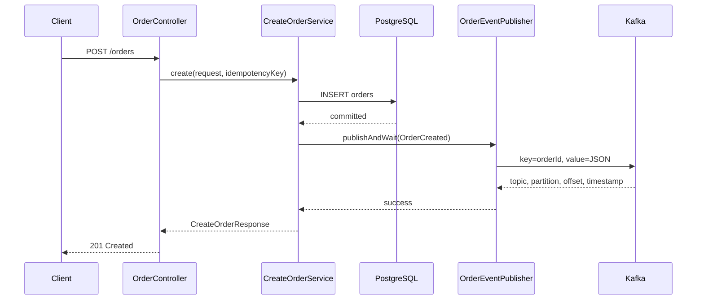

# Giai đoạn 2 - Xây dựng Producer đầu tiên trong Order Service

Tài liệu này hướng dẫn từng bước xây dựng luồng nhỏ nhất:

```text
POST /orders
-> lưu order vào PostgreSQL
-> tạo OrderCreated
-> publish vào order.created.v1
-> nhận metadata từ Kafka broker
-> quan sát record bằng Kafka UI
```

Tài liệu dành cho người mới bắt đầu. Mỗi bước đều có:

- Mục tiêu.
- Kiến thức cần hiểu.
- File cần sửa.
- Code mẫu.
- Giải thích code.
- Cách chạy.
- Kết quả mong đợi.
- Lỗi thường gặp.
- Điều kiện để chuyển sang bước tiếp theo.

> Code trong giai đoạn này cố ý chưa dùng Transactional Outbox. Mục tiêu là
> giúp bạn trực tiếp nhìn thấy dual-write problem trước khi học cách giải quyết.
> Đây là code học tập, chưa phải thiết kế production hoàn chỉnh.

---

## 1. Phạm vi của giai đoạn 2

### Sẽ làm

- Khởi động một Spring Boot application.
- Dùng Flyway tạo bảng `orders`.
- Tạo API `POST /orders`.
- Validate HTTP request.
- Lưu order bằng Spring JDBC.
- Tạo `OrderCreated` event.
- Serialize event thành JSON string.
- Dùng `orderId` làm Kafka message key.
- Gửi event bằng `KafkaTemplate`.
- Xử lý kết quả gửi thành công và thất bại.
- Log topic, partition, offset và timestamp.
- Quan sát database và Kafka UI.
- So sánh synchronous send và asynchronous send.
- Cố tình làm Kafka ngừng hoạt động để quan sát dual-write bug.
- Phân biệt API idempotency, producer idempotence và consumer idempotency.

### Chưa làm

- Inventory Consumer.
- Payment Service.
- Retry topic.
- Dead Letter Queue.
- Transactional Outbox.
- Kafka transaction.
- Avro hoặc Schema Registry.
- Kafka Streams.
- Gửi email thật.

Nếu bắt đầu làm các phần trên trong giai đoạn này, project sẽ trở nên khó debug
vì có quá nhiều khái niệm xuất hiện cùng lúc.

---

## 2. Kết quả cuối cùng cần đạt

Khi gửi:

```http
POST /orders
Content-Type: application/json
Idempotency-Key: create-order-001
```

```json
{
  "customerId": "CUS-001",
  "productId": "PROD-001",
  "quantity": 2,
  "unitPrice": 150000,
  "currency": "VND"
}
```

Order Service cần:

1. Validate request.
2. Sinh `orderId`.
3. Sinh `eventId`.
4. Tính `totalAmount`.
5. Lưu order với trạng thái `PENDING`.
6. Tạo `OrderCreated`.
7. Chuyển event thành JSON.
8. Publish vào `order.created.v1`.
9. Dùng `orderId` làm record key.
10. Chờ broker acknowledgment trong bài lab synchronous.
11. Log metadata.
12. Trả HTTP response.



---

## 3. Cấu trúc file

```text
shared-events/
└── src/main/java/com/thanhdanh/kafkaorder/events/
    └── OrderCreated.java

services/order-service/
└── src/main/
    ├── java/com/thanhdanh/kafkaorder/order/
    │   ├── OrderServiceApplication.java
    │   ├── api/
    │   │   ├── CreateOrderRequest.java
    │   │   ├── CreateOrderResponse.java
    │   │   ├── OrderApiExceptionHandler.java       # tạo ở bước 2.4
    │   │   └── OrderController.java
    │   ├── application/
    │   │   └── CreateOrderService.java
    │   ├── domain/
    │   │   ├── Order.java
    │   │   └── OrderStatus.java
    │   └── infrastructure/
    │       ├── db/
    │       │   └── OrderRepository.java
    │       └── kafka/
    │           ├── OrderEventPublishException.java # tạo ở bước 2.4
    │           └── OrderEventPublisher.java
    └── resources/
        ├── application.yml
        └── db/migration/
            └── V1__create_orders.sql
```

### Trách nhiệm từng tầng

| Package | Trách nhiệm |
|---|---|
| `api` | HTTP request, validation và HTTP response |
| `application` | Điều phối use case tạo order |
| `domain` | Dữ liệu và quy tắc cơ bản của order |
| `infrastructure.db` | Giao tiếp PostgreSQL |
| `infrastructure.kafka` | Giao tiếp Kafka |
| `shared-events` | Event contract dùng chung giữa producer và consumer |

Không đặt SQL trong controller. Không gọi `KafkaTemplate` trực tiếp từ
controller. Không đặt HTTP annotation trong event contract.

---

## 4. Thứ tự thực hành

```text
2.0  Main class
 ↓
2.1  Flyway migration
 ↓
2.2  API chỉ lưu database
 ↓
2.3  OrderCreated event contract
 ↓
2.4  Synchronous Kafka producer
 ↓
2.5  Quan sát database, key, partition, offset
 ↓
2.6  Thử nhiều record có cùng key
 ↓
2.7  Asynchronous send
 ↓
2.8  Kafka-down và dual-write experiment
 ↓
2.9  API idempotency
 ↓
2.10 Ôn producer configuration
```

Không viết mọi file rồi mới chạy. Hãy chạy và kiểm tra sau từng checkpoint.

---

# Bước 2.0 - Tạo Spring Boot main class

## Mục tiêu

- JVM khởi động được Order Service.
- Spring Boot đọc `application.yml`.
- Tomcat chạy ở port `8081`.
- Actuator health endpoint hoạt động.

## File

```text
services/order-service/src/main/java/
com/thanhdanh/kafkaorder/order/OrderServiceApplication.java
```

## Code

```java
package com.thanhdanh.kafkaorder.order;

import org.springframework.boot.SpringApplication;
import org.springframework.boot.autoconfigure.SpringBootApplication;

@SpringBootApplication
public class OrderServiceApplication {

    public static void main(String[] args) {
        SpringApplication.run(OrderServiceApplication.class, args);
    }
}
```

## Giải thích

### `package`

```java
package com.thanhdanh.kafkaorder.order;
```

Package phải khớp với vị trí thư mục. Main class nằm ở package gốc để
`@ComponentScan` tìm được các package con:

```text
api
application
domain
infrastructure
```

### `@SpringBootApplication`

Annotation này kết hợp:

- `@SpringBootConfiguration`: đánh dấu class cấu hình chính.
- `@EnableAutoConfiguration`: tự cấu hình Web MVC, JDBC, Flyway, Kafka và
  Actuator dựa trên dependency.
- `@ComponentScan`: tìm các class được Spring quản lý.

### `main(String[] args)`

Đây là entry point chuẩn của Java. JVM gọi phương thức này khi bạn nhấn Run.

### `SpringApplication.run(...)`

Spring Boot sẽ:

1. Đọc `application.yml`.
2. Đọc environment variables.
3. Tạo Spring Application Context.
4. Quét component.
5. Tạo các bean.
6. Cấu hình DataSource.
7. Chạy Flyway.
8. Cấu hình Kafka producer.
9. Khởi động Tomcat.

## Lưu ý trước khi chạy

File `V1__create_orders.sql` phải được hoàn thiện ở bước 2.1 trước khi chạy lần
đầu. Nếu file chỉ có comment, Flyway vẫn có thể ghi nhận migration V1 là đã
chạy.

Nếu chỉ muốn kiểm tra main class trước, tạm đặt environment variable trong
IntelliJ:

```text
SPRING_FLYWAY_ENABLED=false
```

Sau đó phải xóa biến này trước bước 2.1.

## Kiểm tra

Khởi động hạ tầng:

```bash
cd /Users/thanhdanh/Kafka_Learning
docker compose up -d
```

Chạy main class bằng IntelliJ rồi kiểm tra:

```bash
curl http://localhost:8081/actuator/health
```

Kết quả:

```json
{"status":"UP"}
```

## Hoàn thành khi

- Log có `Started OrderServiceApplication`.
- Port `8081` hoạt động.
- Health trả về `UP`.
- Bạn giải thích được `SpringApplication.run()` làm gì.

---

# Bước 2.1 - Tạo bảng `orders` bằng Flyway

## Mục tiêu

- Hiểu database và schema là hai lớp khác nhau.
- Flyway quản lý version của schema.
- Tạo bảng tối thiểu cho Order Service.

Database `order_db` đã được PostgreSQL init script tạo. Flyway chỉ tạo bảng bên
trong database đó.

## File

```text
services/order-service/src/main/resources/db/migration/
V1__create_orders.sql
```

## Code

```sql
CREATE TABLE orders
(
    order_id        VARCHAR(40)    PRIMARY KEY,
    event_id        UUID           NOT NULL UNIQUE,
    idempotency_key VARCHAR(128)   NOT NULL UNIQUE,
    customer_id     VARCHAR(64)    NOT NULL,
    product_id      VARCHAR(64)    NOT NULL,
    quantity        INTEGER        NOT NULL CHECK (quantity > 0),
    unit_price      NUMERIC(19, 2) NOT NULL CHECK (unit_price >= 0),
    total_amount    NUMERIC(19, 2) NOT NULL CHECK (total_amount >= 0),
    currency        CHAR(3)        NOT NULL,
    status          VARCHAR(32)    NOT NULL,
    created_at      TIMESTAMPTZ    NOT NULL
);

CREATE INDEX idx_orders_customer_id
    ON orders (customer_id);

CREATE INDEX idx_orders_created_at
    ON orders (created_at);
```

## Giải thích từng phần

### `order_id`

```sql
order_id VARCHAR(40) PRIMARY KEY
```

Đây là identity nghiệp vụ của order:

```text
ORD-550e8400-e29b-41d4-a716-446655440000
```

Primary key đảm bảo không có hai row cùng `order_id`.

### `event_id`

```sql
event_id UUID NOT NULL UNIQUE
```

Identity của `OrderCreated`. `eventId` khác `orderId`:

- Một order tồn tại lâu dài.
- Một event biểu diễn một sự việc cụ thể.

Unique constraint giúp phát hiện việc vô tình tái sử dụng event ID.

### `idempotency_key`

```sql
idempotency_key VARCHAR(128) NOT NULL UNIQUE
```

Client gửi key trong HTTP header. Unique constraint là hàng rào chống hai
request logic giống nhau tạo hai row.

### Tiền tệ

```sql
NUMERIC(19, 2)
```

Không dùng `FLOAT` hoặc `DOUBLE` cho tiền vì chúng có sai số nhị phân.

Trong Java sẽ dùng `BigDecimal`.

### `TIMESTAMPTZ`

```sql
created_at TIMESTAMPTZ
```

PostgreSQL lưu một thời điểm tuyệt đối và xử lý timezone phù hợp. Trong Java ta
dùng `Instant`.

### Check constraint

```sql
CHECK (quantity > 0)
```

Validation ở API giúp trả lỗi đẹp, nhưng database constraint vẫn cần để bảo vệ
dữ liệu nếu có bug hoặc một luồng khác ghi trực tiếp.

## Chạy migration

Xóa environment variable tạm:

```text
SPRING_FLYWAY_ENABLED=false
```

nếu đã thêm ở bước trước. Sau đó chạy lại Order Service.

## Kiểm tra

```bash
docker compose exec postgres \
  psql -U kafka_order -d order_db
```

Trong `psql`:

```sql
\dt
```

Kết quả phải có:

```text
orders
flyway_schema_history
```

Kiểm tra history:

```sql
SELECT
    installed_rank,
    version,
    description,
    script,
    success
FROM flyway_schema_history;
```

Kiểm tra cấu trúc:

```sql
\d orders
```

## Nếu V1 đã bị Flyway ghi nhận khi còn trống

Trong môi trường học chưa có dữ liệu quan trọng, cách dễ nhất là reset database
volume:

```bash
docker compose down -v
docker compose up -d
```

Lệnh này xóa toàn bộ Kafka và PostgreSQL data local. Chỉ chạy khi bạn chấp nhận
mất dữ liệu thực hành hiện tại.

## Hoàn thành khi

- `orders` tồn tại.
- `flyway_schema_history` có V1 thành công.
- Constraint và index xuất hiện.
- Khởi động lại service không chạy lại V1.

---

# Bước 2.2 - Tạo API chỉ lưu database

Ở bước này chưa publish Kafka. Mục tiêu là tách lỗi HTTP/database khỏi lỗi
Kafka.

## 2.2.1 Tạo `OrderStatus`

### File

```text
domain/OrderStatus.java
```

### Code

```java
package com.thanhdanh.kafkaorder.order.domain;

public enum OrderStatus {
    PENDING,
    INVENTORY_RESERVED,
    PAID,
    COMPLETED,
    CANCELLED
}
```

### Giải thích

`enum` giới hạn status vào một tập giá trị hợp lệ. So với `String`, enum tránh
lỗi:

```text
PENDNG
pending
Pending
```

Trong giai đoạn 2 chỉ sử dụng `PENDING`. Các trạng thái còn lại dành cho giai
đoạn sau.

---

## 2.2.2 Tạo `Order`

### File

```text
domain/Order.java
```

### Code

```java
package com.thanhdanh.kafkaorder.order.domain;

import java.math.BigDecimal;
import java.time.Instant;
import java.util.UUID;

public record Order(
        String orderId,
        UUID eventId,
        String idempotencyKey,
        String customerId,
        String productId,
        int quantity,
        BigDecimal unitPrice,
        BigDecimal totalAmount,
        String currency,
        OrderStatus status,
        Instant createdAt
) {
}
```

### Giải thích `record`

Java record phù hợp với object dữ liệu bất biến. Java tự sinh:

- Constructor.
- Getter dạng `order.orderId()`.
- `equals()`.
- `hashCode()`.
- `toString()`.

Record không tự validate business rule. Validation request vẫn nằm ở API và
constraint vẫn nằm ở database.

---

## 2.2.3 Tạo HTTP request

### File

```text
api/CreateOrderRequest.java
```

### Code

```java
package com.thanhdanh.kafkaorder.order.api;

import jakarta.validation.constraints.DecimalMin;
import jakarta.validation.constraints.Min;
import jakarta.validation.constraints.NotBlank;
import jakarta.validation.constraints.NotNull;
import jakarta.validation.constraints.Pattern;

import java.math.BigDecimal;

public record CreateOrderRequest(
        @NotBlank
        String customerId,

        @NotBlank
        String productId,

        @Min(1)
        int quantity,

        @NotNull
        @DecimalMin(value = "0.01")
        BigDecimal unitPrice,

        @NotBlank
        @Pattern(regexp = "[A-Z]{3}")
        String currency
) {
}
```

### Giải thích validation

| Annotation | Ý nghĩa |
|---|---|
| `@NotBlank` | Không null, không rỗng và không chỉ có khoảng trắng |
| `@Min(1)` | Quantity tối thiểu là 1 |
| `@NotNull` | Field bắt buộc |
| `@DecimalMin("0.01")` | Giá phải ít nhất 0.01 |
| `@Pattern("[A-Z]{3}")` | Currency gồm đúng ba chữ hoa, ví dụ `VND` |

Spring MVC dùng JSON mapper chuyển request body thành record này.

---

## 2.2.4 Tạo HTTP response

### File

```text
api/CreateOrderResponse.java
```

### Code

```java
package com.thanhdanh.kafkaorder.order.api;

import com.thanhdanh.kafkaorder.order.domain.OrderStatus;

import java.time.Instant;
import java.util.UUID;

public record CreateOrderResponse(
        String orderId,
        UUID eventId,
        OrderStatus status,
        Instant createdAt
) {
}
```

Response chứa `eventId` trong giai đoạn học để dễ đối chiếu database, log và
Kafka UI. Production API không nhất thiết phải trả event ID.

---

## 2.2.5 Tạo repository

### File

```text
infrastructure/db/OrderRepository.java
```

### Code

```java
package com.thanhdanh.kafkaorder.order.infrastructure.db;

import com.thanhdanh.kafkaorder.order.domain.Order;
import org.springframework.jdbc.core.JdbcTemplate;
import org.springframework.stereotype.Repository;

import java.time.OffsetDateTime;
import java.time.ZoneOffset;

@Repository
public class OrderRepository {

    private static final String INSERT_ORDER = """
            INSERT INTO orders (
                order_id,
                event_id,
                idempotency_key,
                customer_id,
                product_id,
                quantity,
                unit_price,
                total_amount,
                currency,
                status,
                created_at
            )
            VALUES (?, ?, ?, ?, ?, ?, ?, ?, ?, ?, ?)
            """;

    private final JdbcTemplate jdbcTemplate;

    public OrderRepository(JdbcTemplate jdbcTemplate) {
        this.jdbcTemplate = jdbcTemplate;
    }

    public void save(Order order) {
        jdbcTemplate.update(
                INSERT_ORDER,
                order.orderId(),
                order.eventId(),
                order.idempotencyKey(),
                order.customerId(),
                order.productId(),
                order.quantity(),
                order.unitPrice(),
                order.totalAmount(),
                order.currency(),
                order.status().name(),
                OffsetDateTime.ofInstant(order.createdAt(), ZoneOffset.UTC)
        );
    }
}
```

### Giải thích `@Repository`

Spring component scan phát hiện class và tạo một bean `OrderRepository`.

`@Repository` cũng biểu đạt rõ đây là lớp truy cập dữ liệu.

### Constructor injection

```java
public OrderRepository(JdbcTemplate jdbcTemplate)
```

Spring Boot đã auto-configure `JdbcTemplate` từ DataSource. Spring truyền bean
đó vào constructor.

Không cần:

```java
new JdbcTemplate(...)
```

### Text block

```java
"""
SQL
"""
```

Đây là Java text block, giúp viết SQL nhiều dòng dễ đọc.

### Dấu `?`

Các dấu `?` là parameter placeholder. `JdbcTemplate` truyền giá trị riêng, thay
vì nối string SQL. Điều này giúp tránh SQL injection và xử lý kiểu dữ liệu đúng
hơn.

### `OffsetDateTime`

Domain dùng `Instant`; repository chuyển nó thành thời gian UTC để PostgreSQL
lưu vào `TIMESTAMPTZ`.

---

## 2.2.6 Tạo service bản database-only

### File

```text
application/CreateOrderService.java
```

### Code tạm thời

```java
package com.thanhdanh.kafkaorder.order.application;

import com.thanhdanh.kafkaorder.order.api.CreateOrderRequest;
import com.thanhdanh.kafkaorder.order.api.CreateOrderResponse;
import com.thanhdanh.kafkaorder.order.domain.Order;
import com.thanhdanh.kafkaorder.order.domain.OrderStatus;
import com.thanhdanh.kafkaorder.order.infrastructure.db.OrderRepository;
import org.springframework.stereotype.Service;

import java.math.BigDecimal;
import java.time.Instant;
import java.util.UUID;

@Service
public class CreateOrderService {

    private final OrderRepository orderRepository;

    public CreateOrderService(OrderRepository orderRepository) {
        this.orderRepository = orderRepository;
    }

    public CreateOrderResponse create(
            CreateOrderRequest request,
            String idempotencyKey
    ) {
        String orderId = "ORD-" + UUID.randomUUID();
        UUID eventId = UUID.randomUUID();
        Instant createdAt = Instant.now();

        BigDecimal totalAmount = request.unitPrice()
                .multiply(BigDecimal.valueOf(request.quantity()));

        Order order = new Order(
                orderId,
                eventId,
                idempotencyKey,
                request.customerId(),
                request.productId(),
                request.quantity(),
                request.unitPrice(),
                totalAmount,
                request.currency(),
                OrderStatus.PENDING,
                createdAt
        );

        orderRepository.save(order);

        return new CreateOrderResponse(
                order.orderId(),
                order.eventId(),
                order.status(),
                order.createdAt()
        );
    }
}
```

### Giải thích

`@Service` làm class trở thành Spring bean chứa application use case.

### Sinh ID

```java
String orderId = "ORD-" + UUID.randomUUID();
UUID eventId = UUID.randomUUID();
```

`orderId` và `eventId` được sinh độc lập vì chúng có ý nghĩa khác nhau.

### Tính tổng tiền

```java
request.unitPrice()
       .multiply(BigDecimal.valueOf(request.quantity()))
```

Không dùng:

```java
double totalAmount
```

vì tiền cần độ chính xác thập phân.

### Lưu database

```java
orderRepository.save(order);
```

Ở phiên bản lab hiện tại không có `@Transactional` trên service. `JdbcTemplate`
sẽ thực hiện update bằng connection thông thường và database commit trước khi
Kafka được thêm ở bước sau.

Điều này được giữ có chủ ý để tái hiện dual-write bug.

---

## 2.2.7 Tạo controller

### File

```text
api/OrderController.java
```

### Code

```java
package com.thanhdanh.kafkaorder.order.api;

import com.thanhdanh.kafkaorder.order.application.CreateOrderService;
import jakarta.validation.Valid;
import org.springframework.http.HttpStatus;
import org.springframework.http.ResponseEntity;
import org.springframework.web.bind.annotation.PostMapping;
import org.springframework.web.bind.annotation.RequestBody;
import org.springframework.web.bind.annotation.RequestHeader;
import org.springframework.web.bind.annotation.RequestMapping;
import org.springframework.web.bind.annotation.RestController;

@RestController
@RequestMapping("/orders")
public class OrderController {

    private final CreateOrderService createOrderService;

    public OrderController(CreateOrderService createOrderService) {
        this.createOrderService = createOrderService;
    }

    @PostMapping
    public ResponseEntity<CreateOrderResponse> create(
            @RequestHeader("Idempotency-Key") String idempotencyKey,
            @Valid @RequestBody CreateOrderRequest request
    ) {
        CreateOrderResponse response =
                createOrderService.create(request, idempotencyKey);

        return ResponseEntity
                .status(HttpStatus.CREATED)
                .body(response);
    }
}
```

### `@RestController`

Spring tạo bean và dùng các method làm HTTP endpoint. Object trả về được tự động
serialize thành JSON.

### `@RequestMapping("/orders")`

Đặt đường dẫn gốc cho controller.

### `@PostMapping`

Method xử lý:

```text
POST /orders
```

### `@RequestHeader`

Lấy `Idempotency-Key` từ HTTP header. Header này mặc định bắt buộc.

### `@Valid @RequestBody`

- `@RequestBody`: chuyển JSON thành `CreateOrderRequest`.
- `@Valid`: kích hoạt validation annotation trong request record.

Nếu request không hợp lệ, Spring trả HTTP 400 trước khi gọi service.

---

## Kiểm tra bước database-only

Gửi request:

```bash
curl -i \
  -X POST http://localhost:8081/orders \
  -H 'Content-Type: application/json' \
  -H 'Idempotency-Key: create-order-001' \
  -d '{
    "customerId": "CUS-001",
    "productId": "PROD-001",
    "quantity": 2,
    "unitPrice": 150000,
    "currency": "VND"
  }'
```

Kết quả:

```http
HTTP/1.1 201 Created
```

```json
{
  "orderId": "ORD-...",
  "eventId": "...",
  "status": "PENDING",
  "createdAt": "2026-07-28T..."
}
```

Kiểm tra database:

```bash
docker compose exec postgres \
  psql -U kafka_order -d order_db \
  -c "SELECT order_id, event_id, status, total_amount FROM orders;"
```

Kiểm tra Kafka UI:

```text
order.created.v1 chưa có record mới
```

## Thử request sai

```json
{
  "customerId": "",
  "productId": "PROD-001",
  "quantity": 0,
  "unitPrice": -10,
  "currency": "vnd"
}
```

Kết quả phải là HTTP 400 và database không có row mới.

## Hoàn thành khi

- HTTP hợp lệ tạo đúng một row.
- HTTP sai trả 400.
- `total_amount` được tính đúng.
- Status là `PENDING`.
- Chưa có Kafka record mới.

---

# Bước 2.3 - Tạo `OrderCreated` event contract

## Mục tiêu

- Phân biệt domain object và integration event.
- Event có identity, version và event time.
- Shared module không chứa Kafka-specific code.

## File

```text
shared-events/src/main/java/
com/thanhdanh/kafkaorder/events/OrderCreated.java
```

## Code

```java
package com.thanhdanh.kafkaorder.events;

import java.math.BigDecimal;
import java.time.Instant;
import java.util.UUID;

public record OrderCreated(
        UUID eventId,
        String eventType,
        int eventVersion,
        Instant occurredAt,
        String correlationId,
        String producer,
        String orderId,
        String customerId,
        String productId,
        int quantity,
        BigDecimal unitPrice,
        BigDecimal totalAmount,
        String currency
) {
}
```

## Giải thích field

| Field | Ý nghĩa |
|---|---|
| `eventId` | Identity của event |
| `eventType` | Tên event, ở đây là `OrderCreated` |
| `eventVersion` | Version schema, bắt đầu từ 1 |
| `occurredAt` | Thời điểm sự việc xảy ra |
| `correlationId` | Liên kết log của cả order flow |
| `producer` | Service tạo event |
| `orderId` | Aggregate ID và Kafka key |
| Các field còn lại | Dữ liệu consumer cần |

### Vì sao event không chỉ chứa `orderId`?

Nếu Inventory Consumer phải gọi ngược Order Service để lấy mọi dữ liệu, hai
service vẫn bị coupling mạnh. Event nên chứa dữ liệu cần thiết cho consumer, nhưng
không nên copy toàn bộ database object.

### Vì sao event là sự thật quá khứ?

Tên `OrderCreated` nghĩa là order đã được tạo. Không đặt tên mơ hồ:

```text
ProcessOrder
HandleOrder
DoOrder
```

---

# Bước 2.4 - Publish synchronous và xử lý metadata

## Mục tiêu

- Serialize `OrderCreated` thành JSON string.
- Gửi bằng `KafkaTemplate<String, String>`.
- Dùng `orderId` làm key.
- Chờ broker acknowledgment.
- Log `RecordMetadata`.
- Không nuốt lỗi send.

## 2.4.1 Tạo exception

### File mới

```text
infrastructure/kafka/OrderEventPublishException.java
```

### Code

```java
package com.thanhdanh.kafkaorder.order.infrastructure.kafka;

public class OrderEventPublishException extends RuntimeException {

    public OrderEventPublishException(String message, Throwable cause) {
        super(message, cause);
    }
}
```

Exception riêng giúp API phân biệt lỗi publish với các lỗi không liên quan.

---

## 2.4.2 Tạo publisher

### File

```text
infrastructure/kafka/OrderEventPublisher.java
```

### Code

```java
package com.thanhdanh.kafkaorder.order.infrastructure.kafka;

import com.thanhdanh.kafkaorder.events.OrderCreated;
import org.apache.kafka.clients.producer.RecordMetadata;
import org.slf4j.Logger;
import org.slf4j.LoggerFactory;
import org.springframework.beans.factory.annotation.Value;
import org.springframework.kafka.core.KafkaTemplate;
import org.springframework.kafka.support.SendResult;
import org.springframework.stereotype.Component;
import tools.jackson.core.JacksonException;
import tools.jackson.databind.json.JsonMapper;

import java.util.concurrent.CompletionException;

@Component
public class OrderEventPublisher {

    private static final Logger log =
            LoggerFactory.getLogger(OrderEventPublisher.class);

    private final KafkaTemplate<String, String> kafkaTemplate;
    private final JsonMapper jsonMapper;
    private final String orderCreatedTopic;

    public OrderEventPublisher(
            KafkaTemplate<String, String> kafkaTemplate,
            JsonMapper jsonMapper,
            @Value("${app.kafka.topics.order-created}")
            String orderCreatedTopic
    ) {
        this.kafkaTemplate = kafkaTemplate;
        this.jsonMapper = jsonMapper;
        this.orderCreatedTopic = orderCreatedTopic;
    }

    public RecordMetadata publishAndWait(OrderCreated event) {
        String json = serialize(event);

        try {
            SendResult<String, String> result = kafkaTemplate
                    .send(orderCreatedTopic, event.orderId(), json)
                    .join();

            RecordMetadata metadata = result.getRecordMetadata();

            log.info(
                    "Published OrderCreated: eventId={}, orderId={}, " +
                            "topic={}, partition={}, offset={}, timestamp={}",
                    event.eventId(),
                    event.orderId(),
                    metadata.topic(),
                    metadata.partition(),
                    metadata.offset(),
                    metadata.timestamp()
            );

            return metadata;
        } catch (CompletionException exception) {
            log.error(
                    "Failed to publish OrderCreated: eventId={}, " +
                            "orderId={}, topic={}",
                    event.eventId(),
                    event.orderId(),
                    orderCreatedTopic,
                    exception
            );

            throw new OrderEventPublishException(
                    "Could not publish OrderCreated for order "
                            + event.orderId(),
                    exception
            );
        } catch (RuntimeException exception) {
            log.error(
                    "Producer failed before completion: eventId={}, " +
                            "orderId={}, topic={}",
                    event.eventId(),
                    event.orderId(),
                    orderCreatedTopic,
                    exception
            );

            throw new OrderEventPublishException(
                    "Could not start Kafka send for order "
                            + event.orderId(),
                    exception
            );
        }
    }

    private String serialize(OrderCreated event) {
        try {
            return jsonMapper.writeValueAsString(event);
        } catch (JacksonException exception) {
            throw new OrderEventPublishException(
                    "Could not serialize OrderCreated "
                            + event.eventId(),
                    exception
            );
        }
    }
}
```

## Giải thích publisher

### `@Component`

Spring tạo `OrderEventPublisher` bean và inject vào `CreateOrderService`.

### `KafkaTemplate<String, String>`

Hai generic type có nghĩa:

```text
K = String key
V = String value
```

Khớp với `application.yml`:

```yaml
key-serializer: StringSerializer
value-serializer: StringSerializer
```

### `JsonMapper`

Spring Boot 4.1 sử dụng Jackson 3 và auto-configure `JsonMapper`:

```java
tools.jackson.databind.json.JsonMapper
```

Nó chuyển Java record thành JSON string.

### `@Value`

```java
@Value("${app.kafka.topics.order-created}")
```

Spring lấy giá trị:

```yaml
app:
  kafka:
    topics:
      order-created: order.created.v1
```

Không hardcode topic trong nhiều class.

### `send(topic, key, value)`

```java
kafkaTemplate.send(
    orderCreatedTopic,
    event.orderId(),
    json
)
```

Ba tham số:

1. Topic: `order.created.v1`.
2. Key: `orderId`.
3. Value: JSON string.

Kafka hash serialized key để chọn partition. Cùng key sẽ vào cùng partition nếu
số partition và partitioner không thay đổi.

### `CompletableFuture`

`send()` trả ngay một future:

```text
CompletableFuture<SendResult<String, String>>
```

Future đại diện cho kết quả sẽ có trong tương lai sau khi broker phản hồi.

### `.join()`

```java
.join()
```

Chặn thread hiện tại cho tới khi:

- Broker acknowledgment thành công; hoặc
- Send thất bại.

Đây là synchronous behavior được tạo trên API asynchronous.

### `SendResult`

Chứa:

- Producer record đã gửi.
- Metadata broker trả về.

### `RecordMetadata`

```java
metadata.topic()
metadata.partition()
metadata.offset()
metadata.timestamp()
```

Metadata chứng minh broker đã chấp nhận record theo cấu hình acknowledgment.
Nó không chứng minh consumer đã xử lý record.

### Vì sao phải bắt exception?

Nếu gọi `send()` rồi bỏ future, lỗi có thể xảy ra sau khi method đã kết thúc.
Producer phải xử lý cả success và failure.

---

## 2.4.3 Cập nhật `CreateOrderService`

Thay phiên bản database-only bằng phiên bản có publisher:

```java
package com.thanhdanh.kafkaorder.order.application;

import com.thanhdanh.kafkaorder.events.OrderCreated;
import com.thanhdanh.kafkaorder.order.api.CreateOrderRequest;
import com.thanhdanh.kafkaorder.order.api.CreateOrderResponse;
import com.thanhdanh.kafkaorder.order.domain.Order;
import com.thanhdanh.kafkaorder.order.domain.OrderStatus;
import com.thanhdanh.kafkaorder.order.infrastructure.db.OrderRepository;
import com.thanhdanh.kafkaorder.order.infrastructure.kafka.OrderEventPublisher;
import org.springframework.stereotype.Service;

import java.math.BigDecimal;
import java.time.Instant;
import java.util.UUID;

@Service
public class CreateOrderService {

    private final OrderRepository orderRepository;
    private final OrderEventPublisher orderEventPublisher;

    public CreateOrderService(
            OrderRepository orderRepository,
            OrderEventPublisher orderEventPublisher
    ) {
        this.orderRepository = orderRepository;
        this.orderEventPublisher = orderEventPublisher;
    }

    public CreateOrderResponse create(
            CreateOrderRequest request,
            String idempotencyKey
    ) {
        String orderId = "ORD-" + UUID.randomUUID();
        UUID eventId = UUID.randomUUID();
        Instant createdAt = Instant.now();

        BigDecimal totalAmount = request.unitPrice()
                .multiply(BigDecimal.valueOf(request.quantity()));

        Order order = new Order(
                orderId,
                eventId,
                idempotencyKey,
                request.customerId(),
                request.productId(),
                request.quantity(),
                request.unitPrice(),
                totalAmount,
                request.currency(),
                OrderStatus.PENDING,
                createdAt
        );

        orderRepository.save(order);

        OrderCreated event = new OrderCreated(
                order.eventId(),
                "OrderCreated",
                1,
                order.createdAt(),
                order.orderId(),
                "order-service",
                order.orderId(),
                order.customerId(),
                order.productId(),
                order.quantity(),
                order.unitPrice(),
                order.totalAmount(),
                order.currency()
        );

        orderEventPublisher.publishAndWait(event);

        return new CreateOrderResponse(
                order.orderId(),
                order.eventId(),
                order.status(),
                order.createdAt()
        );
    }
}
```

## Thứ tự quan trọng

```java
orderRepository.save(order);
orderEventPublisher.publishAndWait(event);
```

Database commit xảy ra trước Kafka publish. Đây là thiết kế ngây thơ có chủ ý để
thực hành dual-write failure ở bước 2.8.

Không thêm `@Transactional` để giả vờ hai hệ thống trở thành một transaction.
Spring JDBC transaction không tự bao phủ Kafka broker.

---

## 2.4.4 Trả HTTP 503 khi Kafka send thất bại

### File mới

```text
api/OrderApiExceptionHandler.java
```

### Code

```java
package com.thanhdanh.kafkaorder.order.api;

import com.thanhdanh.kafkaorder.order.infrastructure.kafka.OrderEventPublishException;
import org.springframework.http.HttpStatus;
import org.springframework.http.ProblemDetail;
import org.springframework.http.ResponseEntity;
import org.springframework.web.bind.annotation.ExceptionHandler;
import org.springframework.web.bind.annotation.RestControllerAdvice;

@RestControllerAdvice
public class OrderApiExceptionHandler {

    @ExceptionHandler(OrderEventPublishException.class)
    public ResponseEntity<ProblemDetail> handlePublishFailure(
            OrderEventPublishException exception
    ) {
        ProblemDetail problem = ProblemDetail.forStatusAndDetail(
                HttpStatus.SERVICE_UNAVAILABLE,
                exception.getMessage()
        );
        problem.setTitle("Kafka is unavailable");

        return ResponseEntity
                .status(HttpStatus.SERVICE_UNAVAILABLE)
                .body(problem);
    }
}
```

### Giải thích

`@RestControllerAdvice` áp dụng xử lý exception cho mọi controller.

`@ExceptionHandler` chuyển `OrderEventPublishException` thành HTTP 503.

Không trả stack trace cho client. Stack trace chỉ nên nằm trong server log.

---

# Bước 2.5 - Chạy happy path và đối chiếu dữ liệu

## 1. Khởi động hạ tầng

```bash
docker compose up -d
docker compose ps
```

Kafka và PostgreSQL phải healthy.

## 2. Chạy Order Service

Chạy `OrderServiceApplication` từ IntelliJ.

## 3. Gửi request

```bash
curl -i \
  -X POST http://localhost:8081/orders \
  -H 'Content-Type: application/json' \
  -H 'Idempotency-Key: stage-2-happy-001' \
  -d '{
    "customerId": "CUS-001",
    "productId": "PROD-001",
    "quantity": 2,
    "unitPrice": 150000,
    "currency": "VND"
  }'
```

## 4. Kiểm tra database

```bash
docker compose exec postgres \
  psql -U kafka_order -d order_db \
  -c "SELECT order_id, event_id, status, total_amount, created_at FROM orders;"
```

## 5. Kiểm tra log

Tìm:

```text
Published OrderCreated
eventId=...
orderId=...
topic=order.created.v1
partition=...
offset=...
timestamp=...
```

## 6. Kiểm tra Kafka UI

Mở:

```text
http://localhost:8088
```

Đi tới:

```text
kafka-order-local
-> Topics
-> order.created.v1
-> Messages
```

Đối chiếu:

| Nguồn | Dữ liệu phải khớp |
|---|---|
| HTTP response | `orderId`, `eventId` |
| PostgreSQL | `orderId`, `eventId`, amount, status |
| Kafka key | `orderId` |
| Kafka value | `eventId`, `orderId`, payload |
| Application log | topic, partition, offset |

## 7. Kiểm tra bằng debug reader

```bash
docker compose exec kafka \
  /opt/kafka/bin/kafka-console-consumer.sh \
  --bootstrap-server kafka:19092 \
  --topic order.created.v1 \
  --group stage-2-debug-reader-1 \
  --from-beginning \
  --max-messages 1 \
  --formatter-property print.key=true \
  --formatter-property print.partition=true \
  --formatter-property print.offset=true
```

Debug group không ảnh hưởng consumer group nghiệp vụ tương lai.

## Hoàn thành khi

- HTTP trả 201.
- Database có order.
- Kafka có event.
- Kafka key đúng bằng `orderId`.
- `eventId` khớp ở mọi nơi.
- Log metadata đúng với Kafka UI.

---

# Bước 2.6 - Thí nghiệm message key và partition

## Mục tiêu

Chứng minh cùng key đi vào cùng partition.

Không cho client tự chọn `orderId` trong public API. Thay vào đó, viết một test
hoặc temporary development runner gọi trực tiếp publisher với cùng `orderId`.

Ví dụ:

```text
key = ORD-PARTITION-TEST

event 1 -> partition 2, offset 10
event 2 -> partition 2, offset 11
event 3 -> partition 2, offset 12
```

Partition có thể là 0, 1 hoặc 2. Điều cần kiểm tra:

- Cả ba record cùng partition.
- Offset tăng trong partition đó.
- Kafka không đảm bảo offset liên tục trên toàn topic.

## Vì sao không dùng `eventId` làm key?

Mỗi event có event ID khác nhau. Nếu dùng event ID:

```text
Event A -> partition 0
Event B -> partition 2
Event C -> partition 1
```

Kafka không còn giữ ordering theo order.

## Lưu ý quan trọng

Cùng `orderId` chỉ giúp ordering trong cùng một topic. Nó không tạo ordering toàn
cục giữa:

```text
order.created.v1
inventory.reserved.v1
payment.completed.v1
```

---

# Bước 2.7 - So sánh synchronous và asynchronous send

## Synchronous hiện tại

```java
kafkaTemplate.send(topic, key, value).join();
```

Luồng:

```text
HTTP thread
-> gửi Kafka
-> chờ broker
-> nhận metadata hoặc exception
-> trả HTTP
```

### Ưu điểm

- Client biết publish thành công hay thất bại.
- Dễ debug.
- Metadata có trước khi trả response.

### Nhược điểm

- Kafka chậm làm HTTP chậm.
- Thread bị giữ trong lúc chờ.
- Không giải quyết dual-write.

## Phiên bản asynchronous để thực hành

Thêm một method tạm trong publisher:

```java
public void publishAsync(OrderCreated event) {
    String json = serialize(event);

    kafkaTemplate
            .send(orderCreatedTopic, event.orderId(), json)
            .whenComplete((result, exception) -> {
                if (exception != null) {
                    log.error(
                            "Async publish failed: eventId={}, orderId={}",
                            event.eventId(),
                            event.orderId(),
                            exception
                    );
                    return;
                }

                RecordMetadata metadata = result.getRecordMetadata();

                log.info(
                        "Async publish completed: eventId={}, orderId={}, " +
                                "topic={}, partition={}, offset={}",
                        event.eventId(),
                        event.orderId(),
                        metadata.topic(),
                        metadata.partition(),
                        metadata.offset()
                );
            });
}
```

## Giải thích `whenComplete`

Callback chạy khi future hoàn thành:

- `exception != null`: send thất bại.
- `exception == null`: `result` chứa metadata.

Không viết:

```java
kafkaTemplate.send(...);
```

rồi bỏ qua future. Cách đó làm lỗi asynchronous dễ bị bỏ sót.

## HTTP status

Nếu API trả trước khi Kafka acknowledgment:

```text
202 Accepted
```

hợp lý hơn `201 Created` nếu bạn đang diễn đạt rằng công việc publish mới chỉ
được chấp nhận.

Tuy nhiên, chưa có Outbox nên ngay cả HTTP 202 cũng không bảo đảm event cuối cùng
sẽ xuất hiện trong Kafka.

## Thí nghiệm

Đo thời gian:

```bash
time curl ...
```

So sánh:

- Synchronous: response chờ broker.
- Asynchronous: response có thể về trước callback log.

Sau thí nghiệm, giữ synchronous version làm baseline cho phần còn lại của giai
đoạn 2.

---

# Bước 2.8 - Kafka-down và dual-write experiment

Đây là thí nghiệm quan trọng nhất.

## Mục tiêu

Tự chứng minh:

```text
PostgreSQL transaction
và
Kafka publish
```

không tự động atomic.

## 1. Thêm timeout ngắn cho profile lab

Trong `application.yml`, tạm thêm dưới producer properties:

```yaml
spring:
  kafka:
    producer:
      properties:
        enable.idempotence: true
        max.in.flight.requests.per.connection: 5
        delivery.timeout.ms: 10000
        request.timeout.ms: 5000
        max.block.ms: 5000
```

Mục đích là không phải chờ quá lâu khi broker dừng. Đây không phải bộ timeout
production.

## 2. Dừng Kafka

```bash
docker compose stop kafka
```

Kafka UI có thể vẫn chạy nhưng không kết nối được broker.

## 3. Gọi API

```bash
curl -i \
  -X POST http://localhost:8081/orders \
  -H 'Content-Type: application/json' \
  -H 'Idempotency-Key: stage-2-kafka-down-001' \
  -d '{
    "customerId": "CUS-002",
    "productId": "PROD-002",
    "quantity": 1,
    "unitPrice": 200000,
    "currency": "VND"
  }'
```

## 4. Kết quả HTTP dự kiến

Sau timeout:

```http
HTTP/1.1 503 Service Unavailable
```

## 5. Kiểm tra database

```bash
docker compose exec postgres \
  psql -U kafka_order -d order_db \
  -c "
    SELECT order_id, event_id, status
    FROM orders
    WHERE idempotency_key = 'stage-2-kafka-down-001';
  "
```

Kết quả dự kiến:

```text
Database vẫn có order PENDING
```

Vì `orderRepository.save()` đã commit trước khi Kafka send thất bại.

## 6. Khởi động Kafka

```bash
docker compose start kafka
docker compose ps
```

## 7. Kiểm tra topic

Tìm event ID của order vừa tạo.

Nếu producer đã hết `delivery.timeout.ms`, event sẽ không tự xuất hiện khi Kafka
trở lại.

Nếu Kafka trở lại trước timeout và producer còn đang retry, send có thể thành
công. Vì vậy cần ghi lại thời điểm và timeout trong thí nghiệm.

## Dual-write bug

```text
Database:
  order tồn tại

Kafka:
  OrderCreated không tồn tại
```

Inventory Service tương lai sẽ không biết order này tồn tại.

## Vì sao không chỉ thêm `@Transactional`?

`@Transactional` của JDBC có thể rollback PostgreSQL nếu exception xảy ra trước
DB commit, nhưng nó không biến PostgreSQL và Kafka thành một atomic transaction.

Vẫn có chiều lỗi:

```text
Kafka nhận event
-> sau đó database rollback
-> Kafka có OrderCreated
-> database không có order
```

Transactional Outbox ở giai đoạn sau mới giải quyết bài toán này một cách đáng
tin cậy.

## Ghi chép bắt buộc

```text
Thời điểm Kafka dừng:
Thời điểm gọi API:
HTTP response:
Database có order không:
Kafka có event không:
Exception:
delivery.timeout.ms:
Kafka được bật lại lúc:
Event có xuất hiện sau đó không:
```

---

# Bước 2.9 - API idempotency

## Mục tiêu

Hai lần retry cùng một HTTP request không tạo hai order và hai event.

## Ba lớp idempotency

| Boundary | Identifier | Giải quyết |
|---|---|---|
| HTTP | `Idempotency-Key` | Client retry request |
| Kafka producer | Producer ID + sequence | Producer retry cùng batch |
| Kafka consumer | `eventId` | Consumer nhận lại record |

Ba cơ chế không thay thế nhau.

## Hành vi mong muốn

### Request đầu tiên

```text
Idempotency-Key: create-order-100
-> tạo order
-> publish event
```

### Request thứ hai cùng key

```text
Idempotency-Key: create-order-100
-> không INSERT order mới
-> không publish event mới
-> trả lại order đã tồn tại
```

### Cùng key nhưng payload khác

Production API nên trả:

```text
409 Conflict
```

Để làm chính xác cần lưu request hash. Bản lab đầu tiên có thể chỉ trả lại order
cũ và ghi chú đây là phần cần cải tiến.

## Repository cần thêm

```text
findByIdempotencyKey(String key)
```

Service thực hiện:

```text
1. Tìm key.
2. Nếu có: trả order cũ, không publish.
3. Nếu chưa có: tạo order.
4. Unique constraint bảo vệ race condition.
```

## Race condition

Cách này chưa đủ nếu chỉ:

```text
SELECT thấy chưa tồn tại
-> INSERT
```

Hai request đồng thời có thể cùng SELECT trước khi một request INSERT.

Database unique constraint:

```sql
UNIQUE (idempotency_key)
```

là hàng rào cuối cùng. Khi duplicate insert xảy ra, ứng dụng cần bắt
`DuplicateKeyException`, đọc row đã có và trả response tương ứng.

## Thí nghiệm

Gửi cùng request hai lần:

```bash
curl ... -H 'Idempotency-Key: duplicate-test-001'
curl ... -H 'Idempotency-Key: duplicate-test-001'
```

Kiểm tra:

```sql
SELECT COUNT(*)
FROM orders
WHERE idempotency_key = 'duplicate-test-001';
```

Kết quả:

```text
1
```

Kafka cũng chỉ có một event ID tương ứng.

## Insight quan trọng

Nếu lần đầu:

```text
DB save thành công
Kafka publish thất bại
```

rồi client retry cùng idempotency key, việc chỉ trả order cũ sẽ không tự publish
lại missing event.

API idempotency không giải quyết dual-write. Outbox vẫn cần thiết.

---

# Bước 2.10 - Hiểu producer configuration

Project đã có:

```yaml
spring:
  kafka:
    producer:
      acks: all
      properties:
        enable.idempotence: true
        max.in.flight.requests.per.connection: 5
```

## `acks=0`

Producer không chờ broker:

```text
send
-> coi như xong
```

- Latency thấp.
- Không biết broker đã nhận chưa.
- Có thể mất record.

## `acks=1`

Partition leader ghi record rồi xác nhận, không chờ follower đồng bộ.

Nếu leader chết trước replication, record có thể mất.

## `acks=all`

Leader chờ các in-sync replica cần thiết trước khi xác nhận. Đây là mức mạnh
nhất.

Nhưng local project chỉ có:

```text
1 broker
replication factor = 1
ISR = {broker 1}
```

Vì vậy `acks=all` hiện vẫn chỉ nhận acknowledgment từ một broker. Nó chưa chứng
minh high availability.

## `enable.idempotence=true`

Producer dùng producer ID và sequence number để broker phát hiện record trùng do
producer retry trong cùng producer session.

Idempotence yêu cầu:

```text
acks=all
retries > 0
max.in.flight.requests.per.connection <= 5
```

Không giải quyết:

- Client gọi HTTP hai lần.
- Hai producer độc lập cùng tạo event.
- Consumer xử lý record hai lần.
- Database/Kafka dual-write.

## `max.in.flight.requests.per.connection=5`

Số request tối đa đã gửi nhưng chưa nhận response trên một connection.

Idempotent producer hiện yêu cầu không vượt quá 5 để duy trì sequence tracking
và ordering guarantee phù hợp.

## `linger.ms`

Producer có thể đợi một khoảng ngắn để gom thêm record vào batch.

```text
linger thấp -> latency thấp, batch nhỏ
linger cao  -> batch lớn, throughput tốt
```

## `batch.size`

Giới hạn kích thước batch theo partition. Record của partition 0 không được gom
chung batch với partition 1.

## `compression.type`

Nén cả batch:

```text
none
gzip
snappy
lz4
zstd
```

Compression giảm network/storage nhưng dùng CPU. Chưa cần tuning khi chỉ gửi một
vài record.

## Serializer

Kafka lưu bytes. Với cấu hình:

```yaml
key-serializer: StringSerializer
value-serializer: StringSerializer
```

Luồng dữ liệu:

```text
orderId String
-> StringSerializer
-> key bytes

OrderCreated
-> JsonMapper
-> JSON String
-> StringSerializer
-> value bytes
```

Kafka broker không hiểu field `orderId` bên trong JSON. Broker chỉ xử lý key
bytes, value bytes và metadata.

---

# Thí nghiệm headers tùy chọn

Sau khi `send(topic, key, value)` hoạt động, có thể học Kafka headers bằng
`ProducerRecord`.

```java
import org.apache.kafka.clients.producer.ProducerRecord;

import java.nio.charset.StandardCharsets;

ProducerRecord<String, String> record = new ProducerRecord<>(
        orderCreatedTopic,
        event.orderId(),
        json
);

record.headers().add(
        "eventType",
        event.eventType().getBytes(StandardCharsets.UTF_8)
);

record.headers().add(
        "eventVersion",
        Integer.toString(event.eventVersion())
                .getBytes(StandardCharsets.UTF_8)
);

kafkaTemplate.send(record);
```

Header phù hợp cho metadata kỹ thuật hoặc routing nhỏ. Không đưa toàn bộ payload
vào header.

---

# Các lỗi thường gặp

## 1. Spring không tìm thấy controller

Nguyên nhân thường là package nằm ngoài phạm vi scan.

Main class phải ở:

```text
com.thanhdanh.kafkaorder.order
```

Controller phải ở package con.

## 2. `JsonMapper` import sai

Project dùng Spring Boot 4.1 và Jackson 3:

```java
import tools.jackson.databind.json.JsonMapper;
```

Không tự động dùng import Jackson 2 cũ:

```java
com.fasterxml.jackson.databind.ObjectMapper
```

## 3. Kafka UI không thấy record

Kiểm tra:

- Đúng topic `order.created.v1`.
- Kafka đang healthy.
- Future có hoàn thành không.
- Log có exception không.
- UI có đang đọc từ earliest/latest phù hợp không.

## 4. Key hiển thị `null`

Đảm bảo:

```java
send(topic, event.orderId(), json)
```

Không dùng:

```java
send(topic, json)
```

## 5. API trả 201 nhưng callback báo lỗi

Đó là asynchronous send. Response đã trả trước khi broker acknowledgment.

## 6. Flyway checksum mismatch

Không sửa nội dung migration đã chạy. Tạo migration mới:

```text
V2__some_change.sql
```

Trong môi trường học có thể reset volume nếu chấp nhận mất dữ liệu.

## 7. Duplicate `Idempotency-Key`

Database unique constraint sẽ từ chối insert. Cần implement logic đọc row cũ
hoặc exception handling thích hợp.

## 8. Order có trong DB nhưng event không có

Đây không nhất thiết là bug trong Kafka. Đây là dual-write problem do application
ghi hai hệ thống riêng biệt.

---

# Checklist hoàn thành giai đoạn 2

Chỉ đánh dấu khi bạn đã tự chạy và quan sát.

## Spring Boot

- [ ] Main class khởi động được.
- [ ] Tôi giải thích được `@SpringBootApplication`.
- [ ] Tôi hiểu Spring đọc `application.yml` nhưng không tự đọc `.env`.
- [ ] Actuator health trả `UP`.

## Database

- [ ] Flyway tạo `orders`.
- [ ] V1 chỉ chạy một lần.
- [ ] Request hợp lệ tạo row.
- [ ] Request sai không tạo row.
- [ ] Status ban đầu là `PENDING`.
- [ ] Tiền dùng `BigDecimal`/`NUMERIC`.

## Event contract

- [ ] `OrderCreated` có `eventId`.
- [ ] Event có version.
- [ ] Event có event time.
- [ ] Tôi phân biệt `eventId`, `orderId` và `Idempotency-Key`.

## Kafka producer

- [ ] Value là JSON string.
- [ ] Key đúng bằng `orderId`.
- [ ] Topic là `order.created.v1`.
- [ ] Log có topic, partition, offset và timestamp.
- [ ] Producer xử lý success và failure.
- [ ] Tôi hiểu broker acknowledgment không phải consumer acknowledgment.

## Partition

- [ ] Nhiều record cùng key vào cùng partition.
- [ ] Offset tăng riêng trong partition.
- [ ] Tôi không kỳ vọng ordering xuyên nhiều topic.

## Reliability

- [ ] Tôi so sánh được synchronous và asynchronous.
- [ ] Tôi tái hiện Kafka-down.
- [ ] Tôi thấy trường hợp DB có order nhưng Kafka không có event.
- [ ] Tôi hiểu vì sao `@Transactional` JDBC không đủ.
- [ ] Tôi hiểu vì sao cần Outbox ở giai đoạn sau.

## Idempotency

- [ ] Cùng HTTP idempotency key không tạo hai order.
- [ ] Tôi hiểu producer idempotence không chống HTTP duplicate.
- [ ] Tôi hiểu consumer vẫn cần idempotency riêng.

---

# Câu hỏi tự kiểm tra

1. Vì sao `OrderCreated` nằm trong `shared-events`?
2. Vì sao Kafka message key là `orderId` thay vì `eventId`?
3. `KafkaTemplate.send()` trả về gì?
4. `.join()` thay đổi asynchronous send thành hành vi gì?
5. Metadata broker có những field nào?
6. Broker acknowledgment chứng minh điều gì?
7. Broker acknowledgment không chứng minh điều gì?
8. Vì sao tiền dùng `BigDecimal`?
9. Vì sao cần validation và database constraint cùng lúc?
10. `acks=all` có chịu được broker failure trong local cluster không?
11. Idempotent producer xử lý loại duplicate nào?
12. Vì sao gọi API hai lần vẫn có thể tạo hai Kafka record hợp lệ?
13. Vì sao `@Transactional` không gộp PostgreSQL và Kafka?
14. Nếu Kafka trở lại sau delivery timeout, event có tự được gửi lại không?
15. Vì sao API idempotency không giải quyết missing Kafka event?
16. Vì sao không được bỏ qua future trả về từ `send()`?
17. Vì sao synchronous API chậm hơn asynchronous API?
18. `linger.ms` ảnh hưởng latency và throughput ra sao?
19. Vì sao cùng key chỉ bảo đảm partition ổn định trong cùng topic?
20. Điều gì sẽ được sửa bằng Transactional Outbox ở giai đoạn sau?

Nếu chưa trả lời được một câu, quay lại thí nghiệm tương ứng thay vì chỉ đọc lại
định nghĩa.

---

# Lệnh kiểm tra nhanh

## Hạ tầng

```bash
docker compose ps
```

## Health

```bash
curl http://localhost:8081/actuator/health
```

## Database

```bash
docker compose exec postgres \
  psql -U kafka_order -d order_db \
  -c "SELECT * FROM orders ORDER BY created_at DESC;"
```

## Topic metadata

```bash
docker compose exec kafka \
  /opt/kafka/bin/kafka-topics.sh \
  --bootstrap-server kafka:19092 \
  --describe \
  --topic order.created.v1
```

## Debug messages

```bash
docker compose exec kafka \
  /opt/kafka/bin/kafka-console-consumer.sh \
  --bootstrap-server kafka:19092 \
  --topic order.created.v1 \
  --group stage-2-debug-reader-final \
  --from-beginning \
  --formatter-property print.key=true \
  --formatter-property print.partition=true \
  --formatter-property print.offset=true
```

## Dừng và bật Kafka

```bash
docker compose stop kafka
docker compose start kafka
```

Không dùng `docker compose down -v` trừ khi muốn xóa toàn bộ dữ liệu local.

---

# Tài liệu đọc kèm

- *Kafka: The Definitive Guide, Second Edition*, Chapter 3.
- [Spring Boot Kafka reference](https://docs.spring.io/spring-boot/4.1/reference/messaging/kafka.html)
- [Spring for Apache Kafka - Sending Messages](https://docs.spring.io/spring-kafka/reference/kafka/sending-messages.html)
- [Spring Boot JDBC](https://docs.spring.io/spring-boot/4.1/reference/data/sql.html)
- [Spring Boot JSON](https://docs.spring.io/spring-boot/4.1/reference/features/json.html)
- [Flyway documentation](https://documentation.red-gate.com/flyway)

